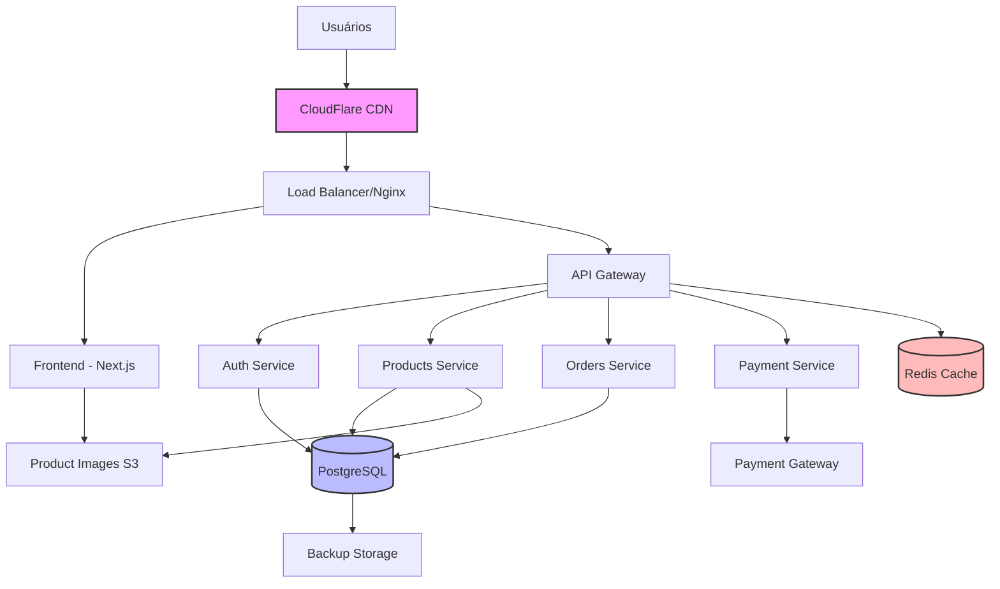

# Claude Response for Issue #1

I'll start by reading the complete issue description and analyzing the existing codebase to understand the requirements.

<bash>
gh issue view 1
</bash>

<bash>
ls -la
</bash>

<bash>
find . -type f -name "*.md" -o -name "*.json" -o -name "*.yml" -o -name "*.yaml" | head -20
</bash>

<bash>
cat README.md 2>/dev/null || echo "No README.md found"
</bash>

<bash>
tree -a -I '.git' -L 3
</bash>

Now I understand the task. I need to document a modern architecture example for a small e-commerce platform that balances cost and performance for low traffic scenarios. Let me create comprehensive documentation including architecture diagrams, implementation examples, and explanations.

<bash>
mkdir -p docs/architecture docs/examples
</bash>

Let me create the main architecture documentation:

<filewrite>
<path>README.md</path>
<content>
# Claude E-commerce Example - Arquitetura Moderna para E-commerce

Este repositório documenta uma arquitetura moderna e otimizada para e-commerce de pequeno porte, focando no equilíbrio entre custo e performance para cenários de baixo a médio tráfego.

## 🎯 Objetivo

Demonstrar uma arquitetura escalável, mas econômica, adequada para pequenos e-commerce que precisam de:
- Alta disponibilidade sem custos excessivos
- Performance otimizada para poucos usuários simultâneos
- Facilidade de manutenção e deploy
- Possibilidade de escalar conforme crescimento

## 📋 Índice

- [Visão Geral da Arquitetura](./docs/architecture/overview.md)
- [Componentes do Sistema](./docs/architecture/components.md)
- [Infraestrutura e Deploy](./docs/architecture/infrastructure.md)
- [Monitoramento e Observabilidade](./docs/architecture/monitoring.md)
- [Exemplos de Implementação](./docs/examples/)
- [Guia de Custos](./docs/architecture/costs.md)

## 🏗️ Arquitetura Resumida

```
┌─────────────────┐    ┌─────────────────┐    ┌─────────────────┐
│   Frontend      │    │   API Gateway   │    │   Microservices │
│   (React/Next)  │───▶│   (Kong/Nginx)  │───▶│   (Node.js)     │
└─────────────────┘    └─────────────────┘    └─────────────────┘
                                                        │
┌─────────────────┐    ┌─────────────────┐             │
│   CDN           │    │   Cache         │             │
│   (CloudFlare)  │    │   (Redis)       │◀────────────┘
└─────────────────┘    └─────────────────┘             │
                                                        │
┌─────────────────┐    ┌─────────────────┐             │
│   Storage       │    │   Database      │             │
│   (S3/MinIO)    │    │   (PostgreSQL)  │◀────────────┘
└─────────────────┘    └─────────────────┘
```

## 🚀 Quick Start

1. **Clone o repositório**
```bash
git clone <repository-url>
cd claude-ecomm-example
```

2. **Explore a documentação**
```bash
# Leia a visão geral da arquitetura
cat docs/architecture/overview.md

# Veja os exemplos de implementação
ls docs/examples/
```

3. **Deploy local com Docker**
```bash
docker-compose up -d
```

## 💰 Estimativa de Custos (Mensal)

Para um e-commerce com ~1000 visitantes/mês:
- **Infraestrutura**: $15-30/mês
- **Database**: $10-20/mês  
- **Storage**: $5-10/mês
- **CDN**: $5-15/mês
- **Total**: ~$35-75/mês

## 📊 Performance Esperada

- **Latência**: < 200ms (95th percentile)
- **Throughput**: 100+ req/s
- **Uptime**: 99.9%
- **Time to First Byte**: < 100ms

## 🛠️ Stack Tecnológica

### Frontend
- **React/Next.js** - Interface do usuário
- **TypeScript** - Tipagem estática
- **TailwindCSS** - Estilização

### Backend
- **Node.js/Express** - API REST
- **TypeScript** - Tipagem estática
- **PostgreSQL** - Database principal
- **Redis** - Cache e sessões

### DevOps
- **Docker** - Containerização
- **Nginx** - Proxy reverso
- **GitHub Actions** - CI/CD
- **Prometheus + Grafana** - Monitoramento

## 📚 Documentação Detalhada

Consulte a pasta [`docs/`](./docs/) para documentação completa:

- [Arquitetura Detalhada](./docs/architecture/)
- [Exemplos de Código](./docs/examples/)
- [Guias de Deploy](./docs/deployment/)

## 🤝 Contribuição

Este é um projeto de exemplo para demonstrar boas práticas arquiteturais. Contribuições são bem-vindas através de issues e pull requests.

## 📄 Licença

MIT License - veja o arquivo [LICENSE](LICENSE) para detalhes.
</content>
</filewrite>

<filewrite>
<path>docs/architecture/overview.md</path>
<content>
# Visão Geral da Arquitetura

## 📖 Introdução

Esta arquitetura foi projetada especificamente para e-commerce de pequeno porte, priorizando:

1. **Custo-benefício**: Recursos dimensionados para baixo tráfego
2. **Simplicidade**: Fácil de entender, implementar e manter
3. **Escalabilidade**: Possibilidade de crescer conforme demanda
4. **Performance**: Otimizada para experiência do usuário

## 🎯 Cenário Alvo

### Características do Negócio
- **Tráfego**: 500-5.000 visitantes únicos/mês
- **Pedidos**: 50-500 pedidos/mês
- **Produtos**: 100-10.000 produtos no catálogo
- **Usuários simultâneos**: 5-50 usuários
- **Picos de tráfego**: 2-3x o tráfego normal (promoções, Black Friday)

### Requisitos Funcionais
- Catálogo de produtos com busca
- Carrinho de compras e checkout
- Gestão de usuários e autenticação
- Processamento de pagamentos
- Gestão de pedidos e estoque
- Painel administrativo

### Requisitos Não-Funcionais
- **Disponibilidade**: 99.9% (8.77h downtime/ano)
- **Performance**: < 2s tempo de carregamento
- **Segurança**: PCI DSS compliance para pagamentos
- **SEO**: Otimizado para motores de busca

## 🏗️ Arquitetura Detalhada

### Diagrama de Alto Nível



### Camadas da Arquitetura

#### 1. **Camada de Apresentação**
- **CDN (CloudFlare)**
  - Cache de assets estáticos
  - Proteção DDoS
  - SSL/TLS terminação
  - Compressão automática

- **Frontend (Next.js)**
  - Server-Side Rendering (SSR) para SEO
  - Static Site Generation (SSG) para páginas de produto
  - Progressive Web App (PWA) capabilities
  - Otimização automática de imagens

#### 2. **Camada de API**
- **API Gateway (Kong/Nginx)**
  - Roteamento de requisições
  - Rate limiting
  - Autenticação/Autorização
  - Logging centralizado

- **Microserviços (Node.js)**
  - Serviços especializados por domínio
  - API REST + GraphQL para flexibilidade
  - Validação de dados com Joi/Zod
  - Documentação automática com Swagger

#### 3. **Camada de Dados**
- **Database Principal (PostgreSQL)**
  - ACID compliance
  - Excelente performance para reads/writes
  - Extensibilidade (JSON, Full-text search)
  - Backup automatizado

- **Cache (Redis)**
  - Cache de sessões
  - Cache de queries frequentes
  - Rate limiting storage
  - Pub/Sub para real-time features

- **Storage (S3/MinIO)**
  - Assets estáticos
  - Imagens de produtos
  - Backup de dados
  - CDN integration

## 🔧 Princípios Arquiteturais

### 1. **Separação de Responsabilidades**
Cada serviço tem uma responsabilidade única e bem definida:
- **Auth Service**: Autenticação, autorização, gestão de usuários
- **Product Service**: Catálogo, busca, categorias
- **Order Service**: Carrinho, checkout, pedidos
- **Payment Service**: Processamento de pagamentos
- **Notification Service**: E-mails, SMS, push notifications

### 2. **Stateless Design**
- Serviços não mantêm estado entre requisições
- Estado armazenado em database ou cache
- Facilita scaling horizontal
- Permite deploy sem downtime

### 3. **Cache-First Strategy**
```
Request → Cache Check → Database (if miss) → Update Cache → Response
```

### 4. **Graceful Degradation**
- Sistema continua funcionando mesmo com falhas parciais
- Fallbacks para funcionalidades críticas
- Circuit breakers para serviços externos

### 5. **Event-Driven Communication**
```javascript
// Exemplo: Processamento de pedido
order.create() 
  → emit('order.created') 
  → [updateStock, sendEmail, processPayment]
```

## 📊 Dimensionamento de Recursos

### Ambiente de Produção (Pequeno Porte)

| Componente | CPU | RAM | Storage | Custo/mês |
|------------|-----|-----|---------|-----------|
| Frontend | 1 vCPU | 1GB | 20GB | $10 |
| API Services | 2 vCPU | 4GB | 40GB | $25 |
| PostgreSQL | 2 vCPU | 4GB | 100GB | $30 |
| Redis | 1 vCPU | 1GB | 10GB | $8 |
| Load Balancer | 1 vCPU | 1GB | 10GB | $5 |
| **Total** | **7 vCPU** | **11GB** | **180GB** | **~$78** |

### Auto-scaling Triggers
- **CPU > 70%** por 5 minutos → Scale up
- **CPU < 30%** por 10 minutos → Scale down
- **Memory > 80%** → Alert + Scale up
- **Response time > 2s** → Scale up

## 🚀 Estratégia de Deploy

### CI/CD Pipeline
```yaml
# .github/workflows/deploy.yml
Stages:
1. Code Quality (ESLint, Prettier, TypeScript)
2. Tests (Unit, Integration, E2E)
3. Security Scan (Snyk, OWASP)
4. Build Docker Images
5. Deploy to Staging
6. Automated Tests in Staging
7. Deploy to Production (Blue-Green)
8. Health Checks
9. Rollback (if needed)
```

### Blue-Green Deployment
- Zero downtime deployments
- Instant rollback capability
- A/B testing possibilities
- Reduced risk

## 📈 Estratégia de Scaling

### Vertical Scaling (Curto Prazo)
1. Aumentar CPU/RAM dos serviços existentes
2. Otimizar queries de database
3. Implementar cache mais agressivo

### Horizontal Scaling (Médio Prazo)
1. Adicionar réplicas dos microserviços
2. Database read replicas
3. Sharding do Redis

### Arquitetura Distribuída (Longo Prazo)
1. Migrar para Kubernetes
2. Implementar service mesh
3. Event sourcing para dados críticos

## 🔍 Próximos Passos

1. [Componentes Detalhados](./components.md)
2. [Infraestrutura e Deploy](./infrastructure.md)
3. [Monitoramento](./monitoring.md)
4. [Análise de Custos](./costs.md)
</content>
</filewrite>

<filewrite>
<path>docs/architecture/components.md</path>
<content>
# Componentes do Sistema

## 🏗️ Arquitetura de Microserviços

### Frontend Application (Next.js)

#### Características
- **Server-Side Rendering (SSR)** para SEO
- **Static Site Generation (SSG)** para páginas de produto
- **Progressive Web App (PWA)** para mobile
- **Image Optimization** automática

#### Estrutura
```
frontend/
├── components/          # Componentes reutilizáveis
│   ├── common/         # Header, Footer, Layout
│   ├── product/        # ProductCard, ProductGrid
│   └── checkout/       # Cart, Payment, Shipping
├── pages/              # Páginas Next.js
│   ├── api/           # API routes
│   ├── products/      # [slug].tsx
│   └── checkout/      # Processo de compra
├── hooks/             # Custom React hooks
├── services/          # API clients
├── utils/             # Funções utilitárias
└── styles/            # TailwindCSS
```

#### Performance Optimizations
```javascript
// next.config.js
module.exports = {
  images: {
    domains: ['cdn.example.com'],
    formats: ['image/webp', 'image/avif'],
  },
  experimental: {
    optimizeCss: true,
    optimizeImages: true,
  },
  compress: true,
  poweredByHeader: false,
}
```

---

## 🔧 Backend Services

### 1. API Gateway (Kong/Nginx)

#### Responsabilidades
- Roteamento de requisições
- Rate limiting
- Autenticação/Autorização
- Load balancing
- Request/Response transformation
- Logging e métricas

#### Configuração Nginx
```nginx
upstream auth_service {
    server auth:3001 max_fails=3 fail_timeout=30s;
    server auth:3002 max_fails=3 fail_timeout=30s;
}

upstream product_service {
    server products:3003 max_fails=3 fail_timeout=30s;
    server products:3004 max_fails=3 fail_timeout=30s;
}

server {
    listen 80;
    server_name api.ecommerce.local;
    
    # Rate limiting
    limit_req_zone $binary_remote_addr zone=api:10m rate=10r/s;
    limit_req zone=api burst=20 nodelay;
    
    # Health check
    location /health {
        access_log off;
        return 200 "healthy\n";
    }
    
    # Auth routes
    location /api/auth {
        proxy_pass http://auth_service;
        include proxy_params;
    }
    
    # Product routes
    location /api/products {
        proxy_pass http://product_service;
        include proxy_params;
    }
}
```

### 2. Authentication Service

#### Features
- JWT-based authentication
- Role-based access control (RBAC)
- Password hashing com bcrypt
- Rate limiting para login attempts
- Social login (Google, Facebook)
- Password reset flow

#### API Endpoints
```typescript
// auth-service/src/routes/auth.ts
interface AuthRoutes {
  'POST /register': {
    body: { email: string; password: string; name: string }
    response: { user: User; token: string }
  }
  
  'POST /login': {
    body: { email: string; password: string }
    response: { user: User; token: string }
  }
  
  'POST /refresh': {
    body: { refreshToken: string }
    response: { token: string }
  }
  
  'POST /forgot-password': {
    body: { email: string }
    response: { message: string }
  }
  
  'GET /profile': {
    headers: { Authorization: string }
    response: { user: User }
  }
}
```

#### Database Schema
```sql
-- Users table
CREATE TABLE users (
    id UUID PRIMARY KEY DEFAULT gen_random_uuid(),
    email VARCHAR(255) UNIQUE NOT NULL,
    password_hash VARCHAR(255) NOT NULL,
    name VARCHAR(255) NOT NULL,
    role VARCHAR(50) DEFAULT 'customer',
    email_verified BOOLEAN DEFAULT false,
    created_at TIMESTAMP DEFAULT NOW(),
    updated_at TIMESTAMP DEFAULT NOW()
);

-- Sessions table
CREATE TABLE user_sessions (
    id UUID PRIMARY KEY DEFAULT gen_random_uuid(),
    user_id UUID REFERENCES users(id) ON DELETE CASCADE,
    refresh_token VARCHAR(500) UNIQUE NOT NULL,
    expires_at TIMESTAMP NOT NULL,
    created_at TIMESTAMP DEFAULT NOW()
);

-- Indexes
CREATE INDEX idx_users_email ON users(email);
CREATE INDEX idx_sessions_user_id ON user_sessions(user_id);
CREATE INDEX idx_sessions_token ON user_sessions(refresh_token);
```

### 3. Products Service

#### Features
- Gerenciamento de produtos e categorias
- Sistema de busca com Elasticsearch
- Cache inteligente com Redis
- Upload de imagens otimizadas
- Controle de estoque
- Preços dinâmicos e promoções

#### API Design
```typescript
// products-service/src/types/product.ts
interface Product {
  id: string
  name: string
  description: string
  price: number
  discountPrice?: number
  sku: string
  categoryId: string
  images: ProductImage[]
  specifications: Record<string, any>
  stock: number
  isActive: boolean
  seoSlug: string
  createdAt: Date
  updatedAt: Date
}

interface ProductImage {
  id: string
  url: string
  alt: string
  order: number
  size: 'thumbnail' | 'medium' | 'large' | 'original'
}
```

#### Search Implementation
```typescript
// products-service/src/services/search.ts
class ProductSearchService {
  async search(query: string, filters: SearchFilters): Promise<SearchResult> {
    const searchQuery = {
      bool: {
        must: [
          {
            multi_match: {
              query,
              fields: ['name^3', 'description^2', 'specifications.*']
            }
          }
        ],
        filter: this.buildFilters(filters)
      }
    }
    
    // Cache results for 5 minutes
    const cacheKey = `search:${hash(searchQuery)}`
    const cached = await this.redis.get(cacheKey)
    
    if (cached) return JSON.parse(cached)
    
    const result = await this.elasticsearch.search({
      index: 'products',
      body: { query: searchQuery }
    })
    
    await this.redis.setex(cacheKey, 300, JSON.stringify(result))
    return result
  }
}
```

### 4. Orders Service

#### Features
- Carrinho de compras persistente
- Processo de checkout multi-step
- Gestão de pedidos
- Cálculo de frete
- Aplicação de cupons de desconto
- Integração com gateway de pagamento

#### State Machine para Pedidos
```typescript
// orders-service/src/models/order-state-machine.ts
enum OrderStatus {
  DRAFT = 'draft',
  PENDING_PAYMENT = 'pending_payment',
  PAID = 'paid',
  PROCESSING = 'processing',
  SHIPPED = 'shipped',
  DELIVERED = 'delivered',
  CANCELLED = 'cancelled',
  REFUNDED = 'refunded'
}

const orderTransitions = {
  [OrderStatus.DRAFT]: [OrderStatus.PENDING_PAYMENT, OrderStatus.CANCELLED],
  [OrderStatus.PENDING_PAYMENT]: [OrderStatus.PAID, OrderStatus.CANCELLED],
  [OrderStatus.PAID]: [OrderStatus.PROCESSING, OrderStatus.REFUNDED],
  [OrderStatus.PROCESSING]: [OrderStatus.SHIPPED, OrderStatus.REFUNDED],
  [OrderStatus.SHIPPED]: [OrderStatus.DELIVERED],
  [OrderStatus.DELIVERED]: [OrderStatus.REFUNDED],
}
```

#### Shopping Cart Logic
```typescript
// orders-service/src/services/cart.ts
class CartService {
  async addItem(userId: string, productId: string, quantity: number) {
    // Verificar estoque
    const product = await this.productService.getById(productId)
    if (product.stock < quantity) {
      throw new Error('Insufficient stock')
    }
    
    // Adicionar ao carrinho (Redis)
    const cartKey = `cart:${userId}`
    const cartItem = { productId, quantity, addedAt: Date.now() }
    
    await this.redis.hset(cartKey, productId, JSON.stringify(cartItem))
    await this.redis.expire(cartKey, 7 * 24 * 3600) // 7 dias
    
    // Invalidar cache do carrinho
    await this.redis.del(`cart:calculated:${userId}`)
    
    return this.getCart(userId)
  }
  
  async calculateTotal(userId: string): Promise<CartTotal> {
    const cacheKey = `cart:calculated:${userId}`
    const cached = await this.redis.get(cacheKey)
    
    if (cached) return JSON.parse(cached)
    
    const cart = await this.getCart(userId)
    const total = cart.items.reduce((sum, item) => {
      return sum + (item.product.price * item.quantity)
    }, 0)
    
    const result = {
      subtotal: total,
      shipping: await this.calculateShipping(cart),
      tax: total * 0.1, // 10% tax
      total: total + shipping + tax,
      items: cart.items
    }
    
    await this.redis.setex(cacheKey, 300, JSON.stringify(result))
    return result
  }
}
```

### 5. Payment Service

#### Features
- Integração com múltiplos gateways (Stripe, PayPal, PagSeguro)
- Processamento assíncrono
- Webhook handling
- Retry logic para falhas
- PCI DSS compliance
- Fraud detection

#### Payment Processing
```typescript
// payment-service/src/services/payment-processor.ts
class PaymentProcessor {
  async processPayment(paymentData: PaymentRequest): Promise<PaymentResult> {
    const { orderId, amount, method, customerData } = paymentData
    
    try {
      // Circuit breaker pattern
      const result = await this.circuitBreaker.execute(() => {
        switch (method) {
          case 'credit_card':
            return this.processCreditCard(paymentData)
          case 'pix':
            return this.processPix(paymentData)
          case 'boleto':
            return this.processBoleto(paymentData)
          default:
            throw new Error('Unsupported payment method')
        }
      })
      
      // Salvar resultado
      await this.paymentRepository.create({
        orderId,
        method,
        amount,
        status: result.status,
        gatewayTransactionId: result.transactionId,
        gatewayResponse: result.response
      })
      
      // Emit event
      await this.eventBus.emit('payment.processed', {
        orderId,
        status: result.status,
        amount
      })
      
      return result
      
    } catch (error) {
      // Log error e retry logic
      await this.handlePaymentError(orderId, error)
      throw error
    }
  }
}
```

## 💾 Data Layer

### PostgreSQL Database

#### Schema Design
```sql
-- Products
CREATE TABLE categories (
    id UUID PRIMARY KEY DEFAULT gen_random_uuid(),
    name VARCHAR(255) NOT NULL,
    slug VARCHAR(255) UNIQUE NOT NULL,
    parent_id UUID REFERENCES categories(id),
    created_at TIMESTAMP DEFAULT NOW()
);

CREATE TABLE products (
    id UUID PRIMARY KEY DEFAULT gen_random_uuid(),
    name VARCHAR(255) NOT NULL,
    description TEXT,
    sku VARCHAR(100) UNIQUE NOT NULL,
    price DECIMAL(10,2) NOT NULL,
    discount_price DECIMAL(10,2),
    category_id UUID REFERENCES categories(id),
    stock INTEGER DEFAULT 0,
    is_active BOOLEAN DEFAULT true,
    seo_slug VARCHAR(255) UNIQUE NOT NULL,
    specifications JSONB,
    created_at TIMESTAMP DEFAULT NOW(),
    updated_at TIMESTAMP DEFAULT NOW()
);

-- Orders
CREATE TABLE orders (
    id UUID PRIMARY KEY DEFAULT gen_random_uuid(),
    user_id UUID REFERENCES users(id),
    status VARCHAR(50) DEFAULT 'draft',
    subtotal DECIMAL(10,2) NOT NULL,
    shipping_cost DECIMAL(10,2) DEFAULT 0,
    tax_amount DECIMAL(10,2) DEFAULT 0,
    total DECIMAL(10,2) NOT NULL,
    shipping_address JSONB,
    billing_address JSONB,
    created_at TIMESTAMP DEFAULT NOW(),
    updated_at TIMESTAMP DEFAULT NOW()
);

CREATE TABLE order_items (
    id UUID PRIMARY KEY DEFAULT gen_random_uuid(),
    order_id UUID REFERENCES orders(id) ON DELETE CASCADE,
    product_id UUID REFERENCES products(id),
    quantity INTEGER NOT NULL,
    unit_price DECIMAL(10,2) NOT NULL,
    total_price DECIMAL(10,2) NOT NULL
);

-- Payments
CREATE TABLE payments (
    id UUID PRIMARY KEY DEFAULT gen_random_uuid(),
    order_id UUID REFERENCES orders(id) ON DELETE CASCADE,
    method VARCHAR(50) NOT NULL,
    status VARCHAR(50) DEFAULT 'pending',
    amount DECIMAL(10,2) NOT NULL,
    gateway_transaction_id VARCHAR(255),
    gateway_response JSONB,
    processed_at TIMESTAMP,
    created_at TIMESTAMP DEFAULT NOW()
);

-- Indexes para performance
CREATE INDEX idx_products_category ON products(category_id);
CREATE INDEX idx_products_active ON products(is_active);
CREATE INDEX idx_products_slug ON products(seo_slug);
CREATE INDEX idx_orders_user ON orders(user_id);
CREATE INDEX idx_orders_status ON orders(status);
CREATE INDEX idx_order_items_order ON order_items(order_id);
CREATE INDEX idx_payments_order ON payments(order_id);
```

### Redis Cache Strategy

#### Cache Patterns
```typescript
// Cache layers
const CACHE_KEYS = {
  // Product cache - 1 hour
  product: (id: string) => `product:${id}`,
  productsByCategory: (categoryId: string) => `products:category:${categoryId}`,
  
  // Search cache - 15 minutes
  search: (query: string, filters: string) => `search:${hash(query + filters)}`,
  
  // User cache - 30 minutes
  userProfile: (userId: string) => `user:${userId}`,
  userCart: (userId: string) => `cart:${userId}`,
  
  // Session cache - 24 hours
  session: (sessionId: string) => `session:${sessionId}`,
}

const CACHE_TTL = {
  product: 3600,      // 1 hour
  search: 900,        // 15 minutes
  user: 1800,         // 30 minutes
  session: 86400,     // 24 hours
  cart: 604800,       // 7 days
}
```

## 📊 Performance Considerations

### Database Optimizations
- Connection pooling (pgbouncer)
- Read replicas para queries pesadas
- Partitioning por data (orders, payments)
- Vacuum automático configurado

### Cache Strategy
- Cache-aside pattern
- Write-through para dados críticos
- Cache warming para produtos populares
- Invalidação inteligente

### API Optimizations
- Compression (gzip)
- Response caching headers
- API versioning
- Pagination padrão
- Field selection (GraphQL style)

## 🔄 Inter-Service Communication

### Event-Driven Architecture
```typescript
// Event bus implementation
interface DomainEvents {
  'user.registered': { userId: string; email: string }
  'order.created': { orderId: string; userId: string; total: number }
  'payment.processed': { orderId: string; status: string; amount: number }
  'product.stock.updated': { productId: string; newStock: number }
}

// Event handlers
class OrderEventHandlers {
  @EventHandler('payment.processed')
  async handlePaymentProcessed(event: DomainEvents['payment.processed']) {
    if (event.status === 'approved') {
      await this.orderService.updateStatus(event.orderId, 'paid')
      await this.notificationService.sendOrderConfirmation(event.orderId)
    }
  }
}
```

### Resilience Patterns
- Circuit breaker
- Retry with exponential backoff
- Timeout configurations
- Graceful degradation
- Health checks

## 🔧 Development Tools

### Code Quality
- ESLint + Prettier
- Husky git hooks
- TypeScript strict mode
- SonarQube integration

### Testing Strategy
- Unit tests (Jest)
- Integration tests (Supertest)
- E2E tests (Playwright)
- Contract tests (Pact)
- Load tests (k6)

### Documentation
- OpenAPI/Swagger specs
- Architecture Decision Records (ADRs)
- Runbooks para operações
- API documentation automática

---

**Próximo:** [Infraestrutura e Deploy](./infrastructure.md)
</content>
</filewrite>

<filewrite>
<path>docs/architecture/infrastructure.md</path>
<content>
# Infraestrutura e Deploy

## 🏗️ Arquitetura de Infraestrutura

### Visão Geral

```mermaid
graph TB
    subgraph "CDN Layer"
        CF[CloudFlare CDN]
    end
    
    subgraph "Loa