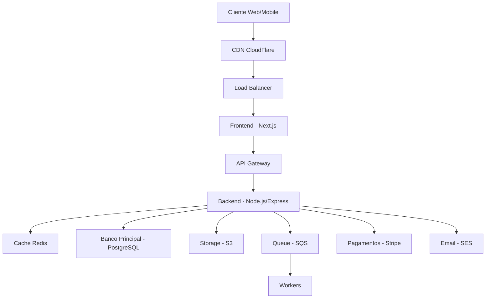
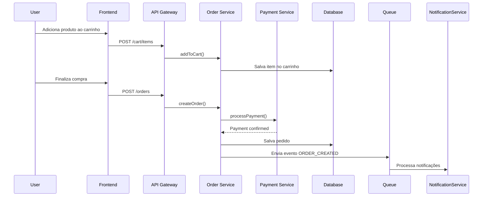
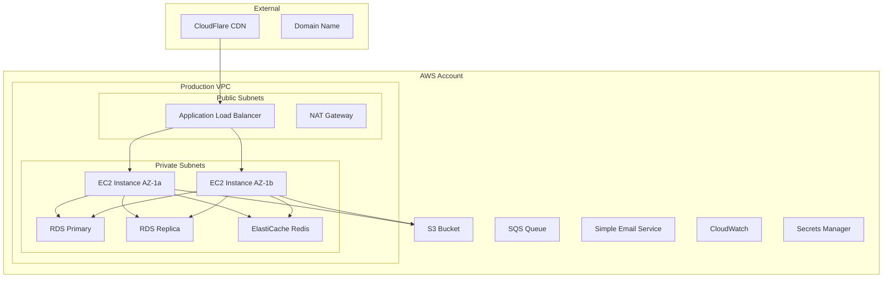

# Claude Response for Issue #1

I'll analyze the issue and implement a comprehensive solution for documenting a modern e-commerce architecture optimized for cost-performance balance with low traffic.

Let me start by examining the issue details and current codebase:

<bash>
gh issue view 1
</bash>

<bash>
find . -type f -name "*.md" -o -name "*.json" -o -name "*.js" -o -name "*.ts" -o -name "*.py" | head -20
</bash>

<bash>
ls -la
</bash>

Now I'll analyze the existing repository structure:

<bash>
tree -a -I '.git' | head -30
</bash>

Based on the issue requirements, I need to document a modern e-commerce architecture that balances cost and performance for low-traffic scenarios. Let me create comprehensive documentation with architectural diagrams, implementation examples, and best practices.

<bash>
mkdir -p docs/architecture docs/examples src/components src/services tests
</bash>

Let me create the main architecture documentation:

<file_editor>
<path>docs/architecture/README.md</path>
<action>create</action>
<text># Arquitetura E-commerce - Pequeno Porte

## Visão Geral

Esta documentação apresenta uma arquitetura moderna para e-commerce de pequeno porte, otimizada para equilibrar custo e performance em cenários de baixo tráfego (até 10.000 visitantes/mês).

## Índice

- [Arquitetura Geral](./general-architecture.md)
- [Stack Tecnológico](./tech-stack.md)
- [Infraestrutura](./infrastructure.md)
- [Segurança](./security.md)
- [Performance](./performance.md)
- [Monitoramento](./monitoring.md)
- [Deployment](./deployment.md)
- [Custos Estimados](./cost-analysis.md)

## Princípios Arquiteturais

### 1. **Simplicidade Primeiro**
- Arquitetura monolítica modular inicialmente
- Migração para microsserviços conforme crescimento
- Tecnologias maduras e bem documentadas

### 2. **Custo-Efetividade**
- Uso de serviços serverless quando possível
- Infraestrutura escalável sob demanda
- Open source como prioridade

### 3. **Performance Otimizada**
- CDN para conteúdo estático
- Cache em múltiplas camadas
- Lazy loading e otimizações de frontend

### 4. **Segurança por Design**
- HTTPS por padrão
- Validação rigorosa de dados
- Princípio do menor privilégio

## Arquitetura de Alto Nível



## Componentes Principais

### Frontend
- **Framework**: Next.js 14 (App Router)
- **Styling**: Tailwind CSS
- **Estado**: Zustand
- **Forms**: React Hook Form + Zod

### Backend
- **Runtime**: Node.js 20+
- **Framework**: Express.js
- **Validação**: Joi/Zod
- **Auth**: JWT + Refresh Tokens

### Banco de Dados
- **Principal**: PostgreSQL (AWS RDS)
- **Cache**: Redis (AWS ElastiCache)
- **Busca**: PostgreSQL Full-text (inicial)

### Infraestrutura
- **Cloud**: AWS (Free Tier + Pay-as-you-go)
- **CDN**: CloudFlare
- **Monitoramento**: AWS CloudWatch + Sentry

## Características da Solução

| Aspecto | Solução | Benefício |
|---------|---------|-----------|
| **Escalabilidade** | Auto Scaling Groups | Cresce conforme demanda |
| **Disponibilidade** | Multi-AZ deployment | 99.9% uptime |
| **Performance** | CDN + Cache multicamadas | < 2s tempo de carregamento |
| **Custo** | Serverless + Reserved Instances | $50-200/mês inicial |
| **Manutenção** | Managed services | Reduz overhead operacional |

## Próximos Passos

1. [Configurar infraestrutura base](./infrastructure.md)
2. [Implementar componentes core](../examples/)
3. [Configurar CI/CD](./deployment.md)
4. [Implementar monitoramento](./monitoring.md)
</text>
</file_editor>

<file_editor>
<path>docs/architecture/general-architecture.md</path>
<action>create</action>
<text># Arquitetura Geral

## Modelo Arquitetural

### Arquitetura em Camadas (Layered Architecture)

A solução adota uma arquitetura em camadas modular que permite evolução gradual para microsserviços:

```
┌─────────────────────────────────────────────────────────┐
│                   PRESENTATION LAYER                    │
│  Next.js Frontend + Mobile App (React Native futuro)   │
└─────────────────────────────────────────────────────────┘
                            │
┌─────────────────────────────────────────────────────────┐
│                    APPLICATION LAYER                    │
│        API Gateway + Express.js + Business Logic       │
└─────────────────────────────────────────────────────────┘
                            │
┌─────────────────────────────────────────────────────────┐
│                     SERVICE LAYER                      │
│   Auth │ Products │ Orders │ Payments │ Notifications  │
└─────────────────────────────────────────────────────────┘
                            │
┌─────────────────────────────────────────────────────────┐
│                      DATA LAYER                        │
│     PostgreSQL │ Redis │ S3 │ External APIs           │
└─────────────────────────────────────────────────────────┘
```

## Padrões Arquiteturais Aplicados

### 1. Repository Pattern
Abstração da camada de dados para facilitar testes e manutenção:

```typescript
interface ProductRepository {
  findById(id: string): Promise<Product | null>
  findByCategory(category: string): Promise<Product[]>
  create(product: CreateProductDTO): Promise<Product>
  update(id: string, data: UpdateProductDTO): Promise<Product>
  delete(id: string): Promise<void>
}
```

### 2. Service Layer Pattern
Encapsula regras de negócio e coordena operações:

```typescript
class OrderService {
  constructor(
    private orderRepository: OrderRepository,
    private productRepository: ProductRepository,
    private paymentService: PaymentService
  ) {}

  async createOrder(orderData: CreateOrderDTO): Promise<Order> {
    // Business logic here
  }
}
```

### 3. Event-Driven Architecture
Para operações assíncronas e desacoplamento:

```typescript
interface DomainEvent {
  type: string
  aggregateId: string
  payload: any
  timestamp: Date
}

// Eventos do domínio
type OrderCreated = DomainEvent & {
  type: 'ORDER_CREATED'
  payload: { orderId: string; customerId: string; total: number }
}
```

## Bounded Contexts (DDD)

### 1. **Catálogo de Produtos**
- Gestão de produtos, categorias, inventário
- Busca e filtros
- Recomendações

### 2. **Gestão de Pedidos**
- Carrinho de compras
- Checkout
- Acompanhamento de pedidos

### 3. **Pagamentos**
- Processamento de pagamentos
- Reembolsos
- Histórico financeiro

### 4. **Usuários e Autenticação**
- Cadastro e login
- Perfis de usuário
- Permissões

### 5. **Notificações**
- Emails transacionais
- Notificações push
- SMS (futuro)

## Fluxo de Dados Principal

### Fluxo de Compra


## Estratégia de Cache

### Múltiplas Camadas de Cache

1. **Browser Cache**
   - Assets estáticos: 1 ano
   - API responses: 5 minutos

2. **CDN Cache (CloudFlare)**
   - Imagens: 30 dias
   - CSS/JS: 1 ano
   - HTML: 5 minutos

3. **Application Cache (Redis)**
   - Produtos populares: 1 hora
   - Sessões de usuário: 24 horas
   - Resultados de busca: 15 minutos

4. **Database Cache**
   - Query results: PostgreSQL buffer pool
   - Connection pooling: pgBouncer

## Tratamento de Erros

### Estratégia de Error Handling

```typescript
class AppError extends Error {
  public readonly statusCode: number
  public readonly isOperational: boolean

  constructor(message: string, statusCode: number, isOperational = true) {
    super(message)
    this.statusCode = statusCode
    this.isOperational = isOperational
  }
}

// Tipos específicos
class ValidationError extends AppError {
  constructor(message: string) {
    super(message, 400)
  }
}

class NotFoundError extends AppError {
  constructor(resource: string) {
    super(`${resource} not found`, 404)
  }
}
```

### Circuit Breaker Pattern
Para serviços externos (pagamento, notificações):

```typescript
class CircuitBreaker {
  private failures = 0
  private lastFailureTime?: Date
  private state: 'CLOSED' | 'OPEN' | 'HALF_OPEN' = 'CLOSED'

  async call<T>(fn: () => Promise<T>): Promise<T> {
    if (this.state === 'OPEN') {
      if (this.shouldAttemptReset()) {
        this.state = 'HALF_OPEN'
      } else {
        throw new Error('Circuit breaker is OPEN')
      }
    }

    try {
      const result = await fn()
      this.onSuccess()
      return result
    } catch (error) {
      this.onFailure()
      throw error
    }
  }
}
```

## Escalabilidade

### Horizontal Scaling Strategy

1. **Stateless Services**
   - Aplicação não mantém estado
   - Session store no Redis
   - Load balancer distribui requisições

2. **Database Scaling**
   - Read replicas para consultas
   - Connection pooling
   - Query optimization

3. **Async Processing**
   - Queue para operações pesadas
   - Background jobs
   - Event-driven updates

### Métricas de Escalabilidade

| Métrica | Limite Atual | Ação de Scale |
|---------|--------------|---------------|
| CPU > 70% | Por 5 min | Add instance |
| Memory > 80% | Por 3 min | Add instance |
| DB connections > 80% | Imediato | Add read replica |
| Queue depth > 100 | Por 2 min | Add worker |
</text>
</file_editor>

<file_editor>
<path>docs/architecture/tech-stack.md</path>
<action>create</action>
<text># Stack Tecnológico

## Visão Geral da Stack

### Frontend Stack

```typescript
// package.json - Frontend dependencies
{
  "dependencies": {
    "next": "^14.0.0",           // React framework
    "react": "^18.2.0",          // UI library
    "typescript": "^5.2.0",      // Type safety
    "tailwindcss": "^3.3.0",     // CSS framework
    "zustand": "^4.4.0",         // State management
    "react-hook-form": "^7.47.0", // Form handling
    "zod": "^3.22.0",            // Schema validation
    "@tanstack/react-query": "^5.0.0", // Server state
    "framer-motion": "^10.16.0", // Animations
    "lucide-react": "^0.292.0"   // Icons
  }
}
```

### Backend Stack

```typescript
// package.json - Backend dependencies
{
  "dependencies": {
    "express": "^4.18.0",        // Web framework
    "typescript": "^5.2.0",      // Type safety
    "prisma": "^5.6.0",          // ORM
    "jsonwebtoken": "^9.0.0",    // Authentication
    "bcryptjs": "^2.4.0",        // Password hashing
    "joi": "^17.11.0",           // Validation
    "redis": "^4.6.0",           // Caching
    "aws-sdk": "^2.1490.0",      // AWS services
    "stripe": "^14.7.0",         // Payments
    "nodemailer": "^6.9.0",      // Email
    "winston": "^3.11.0"         // Logging
  }
}
```

## Justificativas Técnicas

### Por que Next.js?

**Vantagens:**
- **SSR/SSG nativo**: SEO otimizado para e-commerce
- **App Router**: Arquitetura moderna com React Server Components
- **Performance**: Image optimization, lazy loading automático
- **Developer Experience**: Hot reload, TypeScript nativo
- **Ecosystem**: Grande comunidade e plugins

**Alternativas consideradas:**
- **Remix**: Mais novo, menor ecosystem
- **Gatsby**: Melhor para sites estáticos, não para e-commerce dinâmico
- **Vite + React**: Mais configuração manual necessária

### Por que Node.js + Express?

**Vantagens:**
- **Isomorphic**: Mesmo linguagem frontend/backend
- **Ecosystem**: NPM com milhões de pacotes
- **Performance**: V8 engine, event-driven
- **Custo**: Desenvolvedores JavaScript mais acessíveis
- **Rapid Development**: Prototipagem rápida

**Alternativas consideradas:**
- **Python/Django**: Mais lento, menos adequado para real-time
- **Go**: Performance superior, mas curva de aprendizado maior
- **Java/Spring**: Over-engineering para pequeno porte

### Por que PostgreSQL?

**Vantagens:**
- **ACID Compliance**: Transações confiáveis para e-commerce
- **JSON Support**: Flexibilidade para dados não estruturados
- **Full-text Search**: Busca nativa sem Elasticsearch
- **Extensibilidade**: PostGIS para geolocalização futura
- **Custo**: Open source, managed options acessíveis

**Alternativas consideradas:**
- **MongoDB**: Sem transações ACID robustas
- **MySQL**: Menos features avançadas
- **DynamoDB**: Vendor lock-in, complexidade de queries

## Arquitetura de Componentes Frontend

### Design System

```typescript
// Design tokens
export const theme = {
  colors: {
    primary: {
      50: '#eff6ff',
      500: '#3b82f6',
      900: '#1e3a8a'
    },
    gray: {
      50: '#f9fafb',
      900: '#111827'
    }
  },
  spacing: {
    xs: '0.5rem',
    sm: '1rem',
    md: '1.5rem',
    lg: '2rem',
    xl: '3rem'
  },
  typography: {
    fontFamily: {
      sans: ['Inter', 'system-ui', 'sans-serif'],
      mono: ['JetBrains Mono', 'monospace']
    }
  }
} as const
```

### Component Architecture

```
src/
├── components/
│   ├── ui/              # Base components
│   │   ├── Button.tsx
│   │   ├── Input.tsx
│   │   └── Modal.tsx
│   ├── layout/          # Layout components
│   │   ├── Header.tsx
│   │   ├── Footer.tsx
│   │   └── Sidebar.tsx
│   ├── product/         # Domain components
│   │   ├── ProductCard.tsx
│   │   ├── ProductList.tsx
│   │   └── ProductFilter.tsx
│   └── cart/
│       ├── CartItem.tsx
│       └── CartSummary.tsx
├── hooks/               # Custom hooks
├── stores/              # Zustand stores
├── utils/               # Utility functions
└── types/               # TypeScript types
```

## Backend Architecture

### Clean Architecture Structure

```
src/
├── application/         # Use cases
│   ├── usecases/
│   └── interfaces/
├── domain/             # Business logic
│   ├── entities/
│   ├── repositories/
│   └── services/
├── infrastructure/     # External concerns
│   ├── database/
│   ├── cache/
│   ├── queue/
│   └── external-apis/
├── presentation/       # HTTP layer
│   ├── controllers/
│   ├── middleware/
│   └── routes/
└── shared/            # Common utilities
    ├── errors/
    ├── validation/
    └── types/
```

### Database Schema Design

```sql
-- Core entities
CREATE TABLE users (
  id UUID PRIMARY KEY DEFAULT gen_random_uuid(),
  email VARCHAR(255) UNIQUE NOT NULL,
  password_hash VARCHAR(255) NOT NULL,
  first_name VARCHAR(100) NOT NULL,
  last_name VARCHAR(100) NOT NULL,
  created_at TIMESTAMP DEFAULT CURRENT_TIMESTAMP,
  updated_at TIMESTAMP DEFAULT CURRENT_TIMESTAMP
);

CREATE TABLE categories (
  id UUID PRIMARY KEY DEFAULT gen_random_uuid(),
  name VARCHAR(100) NOT NULL,
  slug VARCHAR(100) UNIQUE NOT NULL,
  parent_id UUID REFERENCES categories(id),
  created_at TIMESTAMP DEFAULT CURRENT_TIMESTAMP
);

CREATE TABLE products (
  id UUID PRIMARY KEY DEFAULT gen_random_uuid(),
  name VARCHAR(255) NOT NULL,
  slug VARCHAR(255) UNIQUE NOT NULL,
  description TEXT,
  price DECIMAL(10,2) NOT NULL,
  stock_quantity INTEGER NOT NULL DEFAULT 0,
  category_id UUID REFERENCES categories(id),
  images JSONB DEFAULT '[]',
  attributes JSONB DEFAULT '{}',
  is_active BOOLEAN DEFAULT true,
  created_at TIMESTAMP DEFAULT CURRENT_TIMESTAMP,
  updated_at TIMESTAMP DEFAULT CURRENT_TIMESTAMP
);

-- Indexes for performance
CREATE INDEX idx_products_category ON products(category_id);
CREATE INDEX idx_products_active ON products(is_active);
CREATE INDEX idx_products_price ON products(price);
CREATE INDEX idx_products_search ON products USING GIN(to_tsvector('portuguese', name || ' ' || description));
```

## DevOps & Tooling

### Development Tools

```json
{
  "scripts": {
    "dev": "concurrently \"npm run dev:api\" \"npm run dev:web\"",
    "dev:api": "nodemon src/server.ts",
    "dev:web": "next dev",
    "build": "npm run build:api && npm run build:web",
    "test": "jest --coverage",
    "test:e2e": "playwright test",
    "lint": "eslint . --ext .ts,.tsx",
    "type-check": "tsc --noEmit"
  },
  "devDependencies": {
    "jest": "^29.7.0",
    "playwright": "^1.40.0",
    "eslint": "^8.54.0",
    "@typescript-eslint/eslint-plugin": "^6.12.0",
    "prettier": "^3.1.0",
    "husky": "^8.0.0",
    "lint-staged": "^15.1.0"
  }
}
```

### Code Quality Configuration

```typescript
// eslint.config.js
export default {
  extends: [
    '@typescript-eslint/recommended',
    'next/core-web-vitals',
    'prettier'
  ],
  rules: {
    '@typescript-eslint/no-unused-vars': 'error',
    '@typescript-eslint/explicit-function-return-type': 'warn',
    'prefer-const': 'error',
    'no-var': 'error'
  }
}
```

```json
// .prettierrc
{
  "semi": false,
  "singleQuote": true,
  "tabWidth": 2,
  "trailingComma": "es5",
  "printWidth": 80
}
```

## Performance Considerations

### Frontend Optimization

1. **Bundle Splitting**
   - Route-based code splitting automático (Next.js)
   - Dynamic imports para componentes pesados
   - Vendor chunk separation

2. **Image Optimization**
   - Next.js Image component
   - WebP format com fallback
   - Responsive images automático

3. **State Management**
   - Zustand para estado global leve
   - React Query para server state
   - Local state para UI temporário

### Backend Optimization

1. **Query Optimization**
   - N+1 queries prevention
   - Database indexes estratégicos
   - Connection pooling

2. **Caching Strategy**
   - Redis para hot data
   - Application-level caching
   - HTTP caching headers

3. **Async Processing**
   - Background jobs para operações pesadas
   - Queue para processamento assíncrono
   - Event-driven architecture

## Security Stack

### Authentication & Authorization

```typescript
// JWT Strategy
interface JWTPayload {
  userId: string
  email: string
  role: 'customer' | 'admin'
  iat: number
  exp: number
}

// RBAC Implementation
enum Permission {
  READ_PRODUCTS = 'products:read',
  WRITE_PRODUCTS = 'products:write',
  READ_ORDERS = 'orders:read',
  WRITE_ORDERS = 'orders:write'
}

interface Role {
  name: string
  permissions: Permission[]
}
```

### Security Measures

- **HTTPS Everywhere**: TLS 1.3
- **CSRF Protection**: SameSite cookies
- **XSS Prevention**: Content Security Policy
- **SQL Injection**: Parameterized queries
- **Rate Limiting**: Redis-based
- **Input Validation**: Joi/Zod schemas
- **Password Security**: bcrypt + salt
</text>
</file_editor>

<file_editor>
<path>docs/architecture/infrastructure.md</path>
<action>create</action>
<text># Infraestrutura

## Arquitetura de Infraestrutura AWS

### Visão Geral da Infraestrutura



## Configuração de Infraestrutura

### 1. Terraform Configuration

```hcl
# terraform/main.tf
terraform {
  required_providers {
    aws = {
      source  = "hashicorp/aws"
      version = "~> 5.0"
    }
  }
}

provider "aws" {
  region = var.aws_region
}

# VPC Configuration
resource "aws_vpc" "main" {
  cidr_block           = "10.0.0.0/16"
  enable_dns_hostnames = true
  enable_dns_support   = true

  tags = {
    Name        = "${var.project_name}-vpc"
    Environment = var.environment
  }
}

# Internet Gateway
resource "aws_internet_gateway" "main" {
  vpc_id = aws_vpc.main.id

  tags = {
    Name = "${var.project_name}-igw"
  }
}

# Subnets
resource "aws_subnet" "public" {
  count = 2

  vpc_id                  = aws_vpc.main.id
  cidr_block              = "10.0.${count.index + 1}.0/24"
  availability_zone       = data.aws_availability_zones.available.names[count.index]
  map_public_ip_on_launch = true

  tags = {
    Name = "${var.project_name}-public-${count.index + 1}"
    Type = "public"
  }
}

resource "aws_subnet" "private" {
  count = 2

  vpc_id            = aws_vpc.main.id
  cidr_block        = "10.0.${count.index + 10}.0/24"
  availability_zone = data.aws_availability_zones.available.names[count.index]

  tags = {
    Name = "${var.project_name}-private-${count.index + 1}"
    Type = "private"
  }
}
```

### 2. Application Load Balancer

```hcl
# terraform/alb.tf
resource "aws_lb" "main" {
  name               = "${var.project_name}-alb"
  internal           = false
  load_balancer_type = "application"
  security_groups    = [aws_security_group.alb.id]
  subnets            = aws_subnet.public[*].id

  enable_deletion_protection = var.environment == "production"

  tags = {
    Environment = var.environment
  }
}

resource "aws_lb_target_group" "app" {
  name     = "${var.project_name}-app-tg"
  port     = 3000
  protocol = "HTTP"
  vpc_id   = aws_vpc.main.id

  health_check {
    enabled             = true
    healthy_threshold   = 2
    interval            = 30
    matcher             = "200"
    path                = "/health"
    port                = "traffic-port"
    protocol            = "HTTP"
    timeout             = 5
    unhealthy_threshold = 2
  }

  tags = {
    Name = "${var.project_name}-app-tg"
  }
}

resource "aws_lb_listener" "app" {
  load_balancer_arn = aws_lb.main.arn
  port              = "443"
  protocol          = "HTTPS"
  ssl_policy        = "ELBSecurityPolicy-TLS-1-2-2017-01"
  certificate_arn   = aws_acm_certificate_validation.main.certificate_arn

  default_action {
    type             = "forward"
    target_group_arn = aws_lb_target_group.app.arn
  }
}
```

### 3. EC2 Auto Scaling

```hcl
# terraform/ec2.tf
resource "aws_launch_template" "app" {
  name_prefix   = "${var.project_name}-"
  image_id      = data.aws_ami.amazon_linux.id
  instance_type = var.instance_type

  vpc_security_group_ids = [aws_security_group.app.id]

  user_data = base64encode(templatefile("${path.module}/user-data.sh", {
    db_host     = aws_rds_cluster.main.endpoint
    redis_host  = aws_elasticache_cluster.main.cache_nodes[0].address
    s3_bucket   = aws_s3_bucket.main.bucket
    secrets_arn = aws_secretsmanager_secret.app.arn
  }))

  tag_specifications {
    resource_type = "instance"
    tags = {
      Name = "${var.project_name}-instance"
    }
  }

  lifecycle {
    create_before_destroy = true
  }
}

resource "aws_autoscaling_group" "app" {
  name                = "${var.project_name}-asg"
  vpc_zone_identifier = aws_subnet.private[*].id
  target_group_arns   = [aws_lb_target_group.app.arn]
  health_check_type   = "ELB"

  min_size         = var.min_instances
  max_size         = var.max_instances
  desired_capacity = var.desired_instances

  launch_template {
    id      = aws_launch_template.app.id
    version = "$Latest"
  }

  tag {
    key                 = "Name"
    value               = "${var.project_name}-asg"
    propagate_at_launch = true
  }
}
```

### 4. RDS PostgreSQL

```hcl
# terraform/rds.tf
resource "aws_db_subnet_group" "main" {
  name       = "${var.project_name}-db-subnet-group"
  subnet_ids = aws_subnet.private[*].id

  tags = {
    Name = "${var.project_name} DB subnet group"
  }
}

resource "aws_rds_cluster" "main" {
  cluster_identifier      = "${var.project_name}-db-cluster"
  engine                  = "aurora-postgresql"
  engine_version          = "15.4"
  availability_zones      = data.aws_availability_zones.available.names
  database_name           = var.database_name
  master_username         = var.database_username
  master_password         = random_password.database.result
  backup_retention_period = var.environment == "production" ? 30 : 7
  preferred_backup_window = "07:00-09:00"
  
  db_subnet_group_name   = aws_db_subnet_group.main.name
  vpc_security_