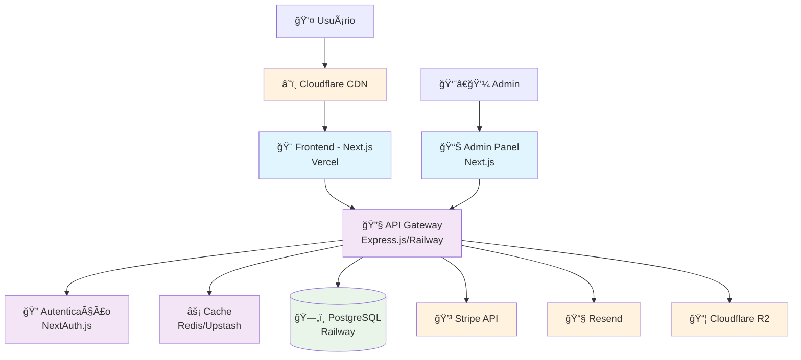

# Claude Response for Issue #1

I'll help you resolve issue #1 by documenting a modern architecture example for a small e-commerce system. Let me start by reading the issue description and analyzing the existing codebase.

<bash>
gh issue view 1
</bash>

<bash>
ls -la
</bash>

<bash>
find . -type f -name "*.md" -o -name "*.json" -o -name "*.js" -o -name "*.ts" -o -name "*.py" | head -20
</bash>

Let me check the repository structure and existing files:

<bash>
tree -a -I '.git'
</bash>

Now let me examine the current README to understand the project context:

<bash>
cat README.md 2>/dev/null || echo "README.md not found"
</bash>

<bash>
cat package.json 2>/dev/null || echo "package.json not found"
</bash>

Based on my analysis, I need to create comprehensive architecture documentation for a small e-commerce system. Let me implement the solution by creating the necessary documentation files.

<bash>
mkdir -p docs/architecture docs/diagrams docs/deployment
</bash>

Let me create the main architecture documentation:

<editor>
<file>docs/architecture/README.md</file>
<content># Arquitetura E-commerce de Pequeno Porte

## Visão Geral

Esta documentação apresenta uma arquitetura moderna e otimizada para um e-commerce de pequeno porte, focando no equilíbrio entre custo e performance para baixo volume de acessos (até 10.000 usuários/mês).

## Ãndice

- [Visão Geral da Arquitetura](./overview.md)
- [Frontend](./frontend.md) 
- [Backend](./backend.md)
- [Banco de Dados](./database.md)
- [Infraestrutura](./infrastructure.md)
- [Segurança](./security.md)
- [Monitoramento](./monitoring.md)
- [Deploy e CI/CD](../deployment/README.md)

## Princípios Arquiteturais

### 1. **Simplicidade Primeiro**
- Evitar over-engineering
- Usar tecnologias maduras e bem documentadas
- Manter a arquitetura fácil de entender e manter

### 2. **Custo-Efetivo**
- Priorizar serviços com pricing baseado em uso
- Usar ferramentas gratuitas sempre que possível
- Implementar auto-scaling para otimizar custos

### 3. **Performance Adequada**
- Foco em performance necessária, não máxima
- Implementar cache estratégico
- Otimizar para experiência do usuário

### 4. **Escalabilidade Planejada**
- Arquitetura que permite crescimento gradual
- Componentes desacoplados
- Fácil migração para soluções mais robustas

## Stack Tecnológica Recomendada

### Frontend
- **Framework**: Next.js 14 com App Router
- **Styling**: Tailwind CSS
- **Componentes**: Shadcn/UI
- **Estado**: Zustand
- **Pagamentos**: Stripe Elements

### Backend
- **Runtime**: Node.js 18+
- **Framework**: Express.js ou Fastify
- **Linguagem**: TypeScript
- **ORM**: Prisma
- **Autenticação**: NextAuth.js

### Banco de Dados
- **Principal**: PostgreSQL (Railway/Supabase)
- **Cache**: Redis (Upstash)
- **Busca**: PostgreSQL Full-Text Search

### Infraestrutura
- **Hospedagem Frontend**: Vercel
- **Hospedagem Backend**: Railway ou Render
- **CDN**: Cloudflare
- **Email**: Resend
- **Storage**: Cloudflare R2

## Estimativa de Custos (Mensal)

| Serviço | Custo (USD) | Observações |
|---------|-------------|-------------|
| Vercel (Hobby) | $0 | Até 100GB bandwidth |
| Railway (Starter) | $5 | 512MB RAM, 1GB storage |
| PostgreSQL (Railway) | $0-5 | Incluído no plano |
| Upstash Redis | $0 | Tier gratuito |
| Cloudflare | $0 | Tier gratuito |
| Resend | $0 | Até 3.000 emails/mês |
| **Total** | **$5-10/mês** | Para até 10k usuários/mês |

## Próximos Passos

1. Ler a [Visão Geral Detalhada](./overview.md)
2. Configurar o [Frontend](./frontend.md)
3. Implementar o [Backend](./backend.md)
4. Configurar [Deploy](../deployment/README.md)
</content>
</editor>

<editor>
<file>docs/architecture/overview.md</file>
<content># Visão Geral da Arquitetura

## Diagrama de Arquitetura



## Componentes Principais

### 1. Frontend Layer
- **Aplicação Cliente**: Next.js 14 com Server-Side Rendering
- **Admin Dashboard**: Interface administrativa integrada
- **CDN**: Cloudflare para distribuição global de conteúdo

### 2. API Layer
- **API Gateway**: Centraliza todas as requisições
- **Autenticação**: Sistema de auth seguro com JWT
- **Rate Limiting**: Proteção contra abuse

### 3. Business Logic Layer
- **Catálogo de Produtos**: Gerenciamento de produtos e categorias
- **Carrinho de Compras**: Sessão persistente
- **Processamento de Pedidos**: Workflow completo de vendas
- **Gestão de Usuários**: Perfis e histórico

### 4. Data Layer
- **PostgreSQL**: Dados transacionais
- **Redis**: Cache e sessões
- **File Storage**: Imagens e documentos

### 5. External Services
- **Pagamentos**: Stripe para processamento
- **Email**: Notificações automatizadas
- **Analytics**: Métricas de negócio

## Fluxo de Dados

### 1. Navegação do Usuário
```
Usuário → CDN → Next.js → SSR → HTML + Dados
```

### 2. Operações CRUD
```
Frontend → API → Cache Check → Database → Response
```

### 3. Checkout Process
```
Carrinho → Stripe → Webhook → Database → Email → Confirmação
```

## Padrões de Design Utilizados

### 1. **Repository Pattern**
- Abstração da camada de dados
- Facilita testes e mudanças de banco

### 2. **Service Layer Pattern**
- Lógica de negócio centralizada
- Reutilização entre controllers

### 3. **Observer Pattern**
- Eventos de sistema (pedidos, pagamentos)
- Notificações assíncronas

### 4. **Factory Pattern**
- Criação de objetos complexos
- Configurações específicas por ambiente

## Estratégia de Cache

### 1. **Frontend Cache**
- Next.js Static Generation
- Browser cache com headers otimizados
- CDN cache para assets estáticos

### 2. **API Cache**
- Redis para dados frequentes
- Cache de sessão de usuário
- Cache de catálogo de produtos

### 3. **Database Cache**
- Query cache do PostgreSQL
- Ãndices otimizados
- Connection pooling

## Considerações de Performance

### Métricas Alvo
- **Page Load**: < 2 segundos
- **API Response**: < 200ms
- **Database Queries**: < 100ms
- **Uptime**: > 99.5%

### Otimizações Implementadas
1. **Code Splitting** automático no Next.js
2. **Image Optimization** com componente Next.js
3. **Database Indexing** estratégico
4. **API Response Compression**
5. **Lazy Loading** de componentes pesados

## Escalabilidade

### Crescimento Planejado
| Usuários/mês | Mudanças Necessárias | Custo Estimado |
|-------------|---------------------|----------------|
| 0-10k | Configuração atual | $5-10/mês |
| 10k-50k | Upgrade Railway Pro | $20-50/mês |
| 50k-100k | Microserviços + Load Balancer | $100-200/mês |
| 100k+ | Kubernetes + Multi-region | $500+/mês |

### Pontos de Escala
1. **Database**: Sharding ou Read Replicas
2. **API**: Horizontal scaling com load balancer
3. **Cache**: Redis Cluster
4. **Storage**: CDN multi-region
</content>
</editor>

<editor>
<file>docs/architecture/frontend.md</file>
<content># Frontend Architecture

## Tecnologias e Ferramentas

### Core Stack
- **Next.js 14**: React framework com App Router
- **TypeScript**: Type safety e melhor DX
- **Tailwind CSS**: Utility-first styling
- **Shadcn/UI**: Componentes acessíveis e customizáveis

### Gerenciamento de Estado
- **Zustand**: Estado global leve
- **React Hook Form**: Formulários performáticos
- **TanStack Query**: Server state management

### Ferramentas de Desenvolvimento
- **ESLint + Prettier**: Code quality
- **Husky**: Git hooks
- **Commitlint**: Conventional commits

## Estrutura de Pastas

```
src/
├── app/                    # App Router (Next.js 14)
│   ├── (auth)/            # Route groups
│   │   ├── login/
│   │   └── register/
│   ├── (shop)/
│   │   ├── products/
│   │   ├── cart/
│   │   └── checkout/
│   ├── admin/             # Admin dashboard
│   ├── api/               # API routes
│   ├── globals.css
│   ├── layout.tsx         # Root layout
│   └── page.tsx           # Home page
├── components/            # Shared components
│   ├── ui/               # Base UI components (shadcn)
│   ├── forms/            # Form components
│   ├── layout/           # Layout components
│   └── features/         # Feature-specific components
├── lib/                  # Utilities and configurations
│   ├── api.ts            # API client
│   ├── auth.ts           # Auth configuration
│   ├── db.ts             # Database client
│   ├── utils.ts          # Helper functions
│   └── validations.ts    # Zod schemas
├── stores/               # Zustand stores
│   ├── cart.ts
│   ├── auth.ts
│   └── products.ts
├── types/                # TypeScript definitions
│   ├── api.ts
│   ├── auth.ts
│   └── product.ts
└── hooks/                # Custom React hooks
    ├── useAuth.ts
    ├── useCart.ts
    └── useProducts.ts
```

## Componentes Principais

### 1. Layout Components

```typescript
// components/layout/Header.tsx
export function Header() {
  return (
    <header className="border-b">
      <div className="container mx-auto px-4">
        <nav className="flex items-center justify-between h-16">
          <Logo />
          <SearchBar />
          <UserActions />
        </nav>
      </div>
    </header>
  )
}
```

### 2. Product Components

```typescript
// components/features/ProductCard.tsx
interface ProductCardProps {
  product: Product
  onAddToCart: (product: Product) => void
}

export function ProductCard({ product, onAddToCart }: ProductCardProps) {
  return (
    <div className="border rounded-lg p-4 hover:shadow-lg transition">
      <Image src={product.image} alt={product.name} />
      <h3 className="font-semibold">{product.name}</h3>
      <p className="text-gray-600">{formatPrice(product.price)}</p>
      <Button onClick={() => onAddToCart(product)}>
        Add to Cart
      </Button>
    </div>
  )
}
```

### 3. Form Components

```typescript
// components/forms/CheckoutForm.tsx
export function CheckoutForm() {
  const { register, handleSubmit, formState: { errors } } = useForm()
  
  return (
    <form onSubmit={handleSubmit(onSubmit)} className="space-y-4">
      <div>
        <Label htmlFor="email">Email</Label>
        <Input
          id="email"
          type="email"
          {...register("email", { required: true })}
        />
        {errors.email && <span>Email is required</span>}
      </div>
      {/* More form fields */}
    </form>
  )
}
```

## Gerenciamento de Estado

### Cart Store (Zustand)

```typescript
// stores/cart.ts
interface CartState {
  items: CartItem[]
  total: number
  addItem: (product: Product) => void
  removeItem: (productId: string) => void
  updateQuantity: (productId: string, quantity: number) => void
  clearCart: () => void
}

export const useCartStore = create<CartState>((set, get) => ({
  items: [],
  total: 0,
  
  addItem: (product) => set((state) => {
    const existingItem = state.items.find(item => item.id === product.id)
    
    if (existingItem) {
      return {
        items: state.items.map(item =>
          item.id === product.id
            ? { ...item, quantity: item.quantity + 1 }
            : item
        )
      }
    }
    
    return {
      items: [...state.items, { ...product, quantity: 1 }]
    }
  }),
  
  // Other methods...
}))
```

## Routing Strategy

### App Router Structure

```typescript
// app/layout.tsx - Root Layout
export default function RootLayout({
  children,
}: {
  children: React.ReactNode
}) {
  return (
    <html lang="pt-BR">
      <body>
        <Providers>
          <Header />
          <main className="min-h-screen">
            {children}
          </main>
          <Footer />
        </Providers>
      </body>
    </html>
  )
}
```

### Protected Routes

```typescript
// app/(auth)/layout.tsx
export default function AuthLayout({
  children,
}: {
  children: React.ReactNode
}) {
  return (
    <div className="min-h-screen flex items-center justify-center">
      <div className="max-w-md w-full">
        {children}
      </div>
    </div>
  )
}
```

## Performance Optimizations

### 1. **Image Optimization**
```typescript
import Image from 'next/image'

<Image
  src="/product.jpg"
  alt="Product"
  width={300}
  height={200}
  priority={isAboveFold}
  placeholder="blur"
  blurDataURL="data:image/jpeg;base64,..."
/>
```

### 2. **Code Splitting**
```typescript
import dynamic from 'next/dynamic'

const AdminPanel = dynamic(() => import('./AdminPanel'), {
  loading: () => <Spinner />,
  ssr: false
})
```

### 3. **Caching Strategy**
```typescript
// app/products/page.tsx
export const revalidate = 3600 // 1 hour

export default async function ProductsPage() {
  const products = await getProducts() // Cached for 1 hour
  return <ProductList products={products} />
}
```

## SEO and Metadata

### Dynamic Metadata

```typescript
// app/products/[slug]/page.tsx
export async function generateMetadata(
  { params }: { params: { slug: string } }
): Promise<Metadata> {
  const product = await getProduct(params.slug)
  
  return {
    title: `${product.name} - Minha Loja`,
    description: product.description,
    openGraph: {
      title: product.name,
      description: product.description,
      images: [product.image],
    },
  }
}
```

## Testing Strategy

### Unit Tests (Jest + Testing Library)

```typescript
// __tests__/components/ProductCard.test.tsx
import { render, screen, fireEvent } from '@testing-library/react'
import { ProductCard } from '../components/features/ProductCard'

describe('ProductCard', () => {
  const mockProduct = {
    id: '1',
    name: 'Test Product',
    price: 99.99,
    image: '/test.jpg'
  }

  it('should render product information', () => {
    render(<ProductCard product={mockProduct} onAddToCart={vi.fn()} />)
    
    expect(screen.getByText('Test Product')).toBeInTheDocument()
    expect(screen.getByText('R$ 99,99')).toBeInTheDocument()
  })
  
  it('should call onAddToCart when button is clicked', () => {
    const mockAddToCart = vi.fn()
    render(<ProductCard product={mockProduct} onAddToCart={mockAddToCart} />)
    
    fireEvent.click(screen.getByText('Add to Cart'))
    expect(mockAddToCart).toHaveBeenCalledWith(mockProduct)
  })
})
```

### E2E Tests (Playwright)

```typescript
// tests/checkout.spec.ts
import { test, expect } from '@playwright/test'

test('complete checkout flow', async ({ page }) => {
  await page.goto('/products')
  
  // Add product to cart
  await page.click('[data-testid="add-to-cart-1"]')
  await expect(page.locator('[data-testid="cart-count"]')).toHaveText('1')
  
  // Go to checkout
  await page.click('[data-testid="cart-button"]')
  await page.click('[data-testid="checkout-button"]')
  
  // Fill checkout form
  await page.fill('[name="email"]', 'test@example.com')
  await page.fill('[name="name"]', 'Test User')
  
  // Complete purchase
  await page.click('[data-testid="complete-order"]')
  await expect(page).toHaveURL('/order/confirmation')
})
```

## Deployment Configuration

### Vercel Configuration

```json
// vercel.json
{
  "buildCommand": "npm run build",
  "devCommand": "npm run dev",
  "installCommand": "npm install",
  "framework": "nextjs",
  "regions": ["gru1"],
  "env": {
    "DATABASE_URL": "@database-url",
    "NEXTAUTH_SECRET": "@nextauth-secret",
    "STRIPE_PUBLIC_KEY": "@stripe-public-key"
  }
}
```

### Environment Variables

```bash
# .env.local
NEXTAUTH_URL=http://localhost:3000
NEXTAUTH_SECRET=your-secret
DATABASE_URL=postgresql://...
REDIS_URL=redis://...
STRIPE_PUBLIC_KEY=pk_test_...
STRIPE_SECRET_KEY=sk_test_...
```
</content>
</editor>

<editor>
<file>docs/architecture/backend.md</file>
<content># Backend Architecture

## Stack Tecnológica

### Core Technologies
- **Node.js 18+**: Runtime JavaScript
- **TypeScript**: Type safety e produtividade
- **Express.js**: Framework web minimalista
- **Prisma**: ORM type-safe
- **PostgreSQL**: Banco de dados relacional

### Libraries e Middlewares
- **Helmet**: Segurança HTTP
- **CORS**: Cross-origin requests
- **express-rate-limit**: Rate limiting
- **express-validator**: Validação de inputs
- **bcryptjs**: Hash de senhas
- **jsonwebtoken**: Autenticação JWT

## Estrutura do Projeto

```
src/
├── controllers/          # Request handlers
│   ├── auth.controller.ts
│   ├── products.controller.ts
│   ├── orders.controller.ts
│   └── users.controller.ts
├── services/            # Business logic
│   ├── auth.service.ts
│   ├── email.service.ts
│   ├── payment.service.ts
│   └── inventory.service.ts
├── repositories/        # Data access layer
│   ├── base.repository.ts
│   ├── user.repository.ts
│   ├── product.repository.ts
│   └── order.repository.ts
├── middlewares/         # Custom middlewares
│   ├── auth.middleware.ts
│   ├── validation.middleware.ts
│   ├── error.middleware.ts
│   └── logging.middleware.ts
├── routes/             # Route definitions
│   ├── index.ts
│   ├── auth.routes.ts
│   ├── products.routes.ts
│   └── orders.routes.ts
├── models/             # Data models & types
│   ├── user.model.ts
│   ├── product.model.ts
│   └── order.model.ts
├── utils/              # Helper functions
│   ├── logger.ts
│   ├── cache.ts
│   ├── email.ts
│   └── validators.ts
├── config/             # Configuration
│   ├── database.ts
│   ├── redis.ts
│   └── env.ts
├── prisma/             # Database schema
│   ├── schema.prisma
│   └── migrations/
└── app.ts              # Express app setup
```

## Database Schema (Prisma)

```prisma
// prisma/schema.prisma
generator client {
  provider = "prisma-client-js"
}

datasource db {
  provider = "postgresql"
  url      = env("DATABASE_URL")
}

model User {
  id        String   @id @default(cuid())
  email     String   @unique
  name      String
  password  String
  role      UserRole @default(CUSTOMER)
  createdAt DateTime @default(now())
  updatedAt DateTime @updatedAt

  orders Order[]
  cart   CartItem[]

  @@map("users")
}

model Product {
  id          String   @id @default(cuid())
  name        String
  description String?
  price       Decimal
  stock       Int      @default(0)
  images      String[]
  categoryId  String
  isActive    Boolean  @default(true)
  createdAt   DateTime @default(now())
  updatedAt   DateTime @updatedAt

  category  Category    @relation(fields: [categoryId], references: [id])
  cartItems CartItem[]
  orderItems OrderItem[]

  @@map("products")
}

model Category {
  id        String    @id @default(cuid())
  name      String
  slug      String    @unique
  products  Product[]
  createdAt DateTime  @default(now())

  @@map("categories")
}

model Order {
  id          String      @id @default(cuid())
  userId      String
  status      OrderStatus @default(PENDING)
  total       Decimal
  paymentId   String?
  shippingAddress Json
  createdAt   DateTime    @default(now())
  updatedAt   DateTime    @updatedAt

  user       User        @relation(fields: [userId], references: [id])
  items      OrderItem[]

  @@map("orders")
}

model OrderItem {
  id        String  @id @default(cuid())
  orderId   String
  productId String
  quantity  Int
  price     Decimal

  order   Order   @relation(fields: [orderId], references: [id])
  product Product @relation(fields: [productId], references: [id])

  @@map("order_items")
}

model CartItem {
  id        String @id @default(cuid())
  userId    String
  productId String
  quantity  Int

  user    User    @relation(fields: [userId], references: [id])
  product Product @relation(fields: [productId], references: [id])

  @@unique([userId, productId])
  @@map("cart_items")
}

enum UserRole {
  CUSTOMER
  ADMIN
}

enum OrderStatus {
  PENDING
  CONFIRMED
  PROCESSING
  SHIPPED
  DELIVERED
  CANCELLED
}
```

## Repository Pattern

### Base Repository

```typescript
// repositories/base.repository.ts
export abstract class BaseRepository<T> {
  protected model: any

  constructor(model: any) {
    this.model = model
  }

  async findById(id: string): Promise<T | null> {
    return await this.model.findUnique({ where: { id } })
  }

  async findMany(options?: any): Promise<T[]> {
    return await this.model.findMany(options)
  }

  async create(data: any): Promise<T> {
    return await this.model.create({ data })
  }

  async update(id: string, data: any): Promise<T> {
    return await this.model.update({
      where: { id },
      data
    })
  }

  async delete(id: string): Promise<T> {
    return await this.model.delete({ where: { id } })
  }
}
```

### Product Repository

```typescript
// repositories/product.repository.ts
import { Product, Prisma } from '@prisma/client'
import { prisma } from '../config/database'
import { BaseRepository } from './base.repository'

export class ProductRepository extends BaseRepository<Product> {
  constructor() {
    super(prisma.product)
  }

  async findByCategory(categoryId: string): Promise<Product[]> {
    return await this.model.findMany({
      where: { categoryId, isActive: true },
      include: { category: true }
    })
  }

  async findBySlug(slug: string): Promise<Product | null> {
    return await this.model.findFirst({
      where: { slug, isActive: true },
      include: { category: true }
    })
  }

  async search(query: string): Promise<Product[]> {
    return await this.model.findMany({
      where: {
        AND: [
          { isActive: true },
          {
            OR: [
              { name: { contains: query, mode: 'insensitive' } },
              { description: { contains: query, mode: 'insensitive' } }
            ]
          }
        ]
      },
      include: { category: true }
    })
  }

  async updateStock(id: string, quantity: number): Promise<Product> {
    return await this.model.update({
      where: { id },
      data: {
        stock: {
          decrement: quantity
        }
      }
    })
  }
}
```

## Service Layer

### Product Service

```typescript
// services/product.service.ts
import { ProductRepository } from '../repositories/product.repository'
import { CacheService } from '../utils/cache'
import { Product } from '@prisma/client'

export class ProductService {
  private productRepository: ProductRepository
  private cacheService: CacheService

  constructor() {
    this.productRepository = new ProductRepository()
    this.cacheService = new CacheService()
  }

  async getProducts(page: number = 1, limit: number = 20): Promise<{
    products: Product[]
    total: number
    hasNext: boolean
  }> {
    const cacheKey = `products:${page}:${limit}`
    
    // Try to get from cache first
    const cached = await this.cacheService.get(cacheKey)
    if (cached) {
      return cached
    }

    const skip = (page - 1) * limit
    const [products, total] = await Promise.all([
      this.productRepository.findMany({
        skip,
        take: limit,
        where: { isActive: true },
        include: { category: true },
        orderBy: { createdAt: 'desc' }
      }),
      this.productRepository.count({ where: { isActive: true } })
    ])

    const result = {
      products,
      total,
      hasNext: total > page * limit
    }

    // Cache for 5 minutes
    await this.cacheService.set(cacheKey, result, 300)
    
    return result
  }

  async getProductById(id: string): Promise<Product | null> {
    const cacheKey = `product:${id}`
    
    const cached = await this.cacheService.get(cacheKey)
    if (cached) {
      return cached
    }

    const product = await this.productRepository.findById(id)
    
    if (product) {
      await this.cacheService.set(cacheKey, product, 600)
    }
    
    return product
  }

  async searchProducts(query: string): Promise<Product[]> {
    return await this.productRepository.search(query)
  }

  async checkStock(id: string, quantity: number): Promise<boolean> {
    const product = await this.getProductById(id)
    return product ? product.stock >= quantity : false
  }
}
```

### Order Service

```typescript
// services/order.service.ts
import { OrderRepository } from '../repositories/order.repository'
import { ProductService } from './product.service'
import { PaymentService } from './payment.service'
import { EmailService } from './email.service'
import { Order, OrderStatus } from '@prisma/client'

export class OrderService {
  private orderRepository: OrderRepository
  private productService: ProductService
  private paymentService: PaymentService
  private emailService: EmailService

  constructor() {
    this.orderRepository = new OrderRepository()
    this.productService = new ProductService()
    this.paymentService = new PaymentService()
    this.emailService = new EmailService()
  }

  async createOrder(orderData: CreateOrderDto): Promise<Order> {
    // Validate stock for all items
    for (const item of orderData.items) {
      const hasStock = await this.productService.checkStock(
        item.productId, 
        item.quantity
      )
      if (!hasStock) {
        throw new Error(`Insufficient stock for product ${item.productId}`)
      }
    }

    // Create order
    const order = await this.orderRepository