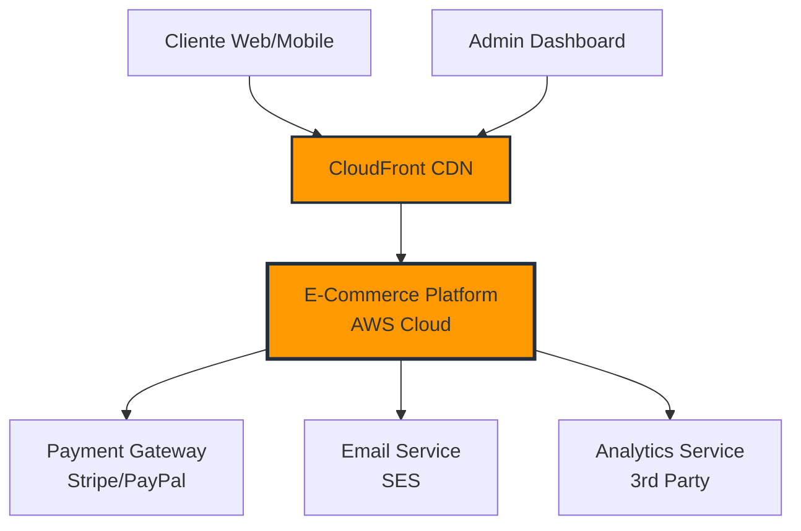
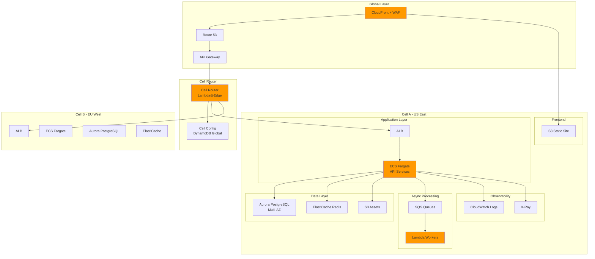
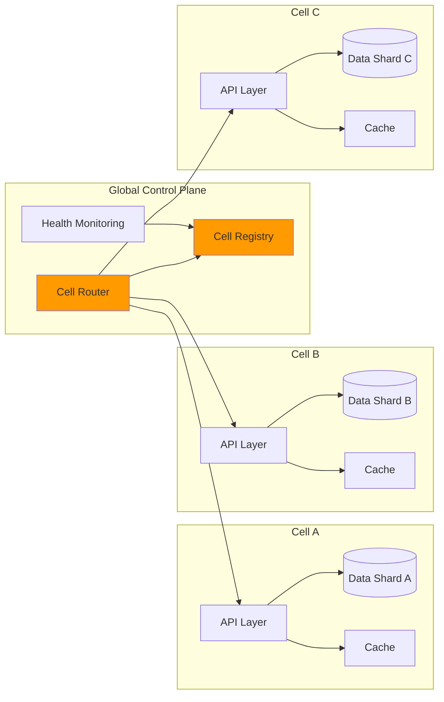

# Arquitetura de Referência - Plataforma E-Commerce

## 1. Visão Geral

Esta proposta apresenta uma arquitetura de referência para uma plataforma de e-commerce escalável, de baixo custo e resiliente, hospedada 100% na AWS. A arquitetura segue os princípios de **Cell-Based Architecture** para garantir isolamento de falhas e escalabilidade horizontal, com foco em observabilidade e otimização de custos.

### Princípios Arquiteturais

- **Escalabilidade horizontal**: Uso de células independentes que podem ser replicadas
- **Baixo custo**: Pay-per-use, autoscaling e otimizações específicas
- **Resiliência**: Isolamento de falhas com blast radius limitado
- **Observabilidade**: Métricas, logs e tracing end-to-end
- **Simplicidade operacional**: Infraestrutura como código e automação

---

## 2. Diagramas de Arquitetura

### 2.1. Diagrama C4 - Nível 1 (System Context)



### 2.2. Diagrama C4 - Nível 2 (Container Diagram)



### 2.3. Diagrama de Células (Cell-Based Architecture)



---

## 3. Serviços AWS e Justificativas

### 3.1. Frontend e Entrega de Conteúdo

| Serviço | Justificativa | Custo Estimado |
|---------|--------------|----------------|
| **CloudFront** | CDN global com baixa latência, cache edge, integração com S3 | $0.085/GB (após 10TB) |
| **S3** | Hospedagem de site estático (React/Next.js), alta disponibilidade | $0.023/GB storage |
| **Route 53** | DNS gerenciado, health checks, roteamento geográfico | $0.50/hosted zone + $0.40/million queries |

**ADR-001: CloudFront + S3 Static Site**
- Reduz latência global (edge locations)
- Custo ~90% menor vs instâncias EC2
- Escala automaticamente sem configuração
- Cache edge reduz carga no backend

### 3.2. Camada de Aplicação

| Serviço | Justificativa | Custo Estimado |
|---------|--------------|----------------|
| **API Gateway** | Gerenciamento de APIs, throttling, autenticação, métricas | $3.50/million requests |
| **ECS Fargate** | Containers serverless, sem gerenciamento de infra, autoscaling | $0.04048/vCPU-hora + $0.004445/GB-hora |
| **Lambda** | Processamento assíncrono, workers, integração com SQS | $0.20/million requests + $0.0000166667/GB-s |
| **ALB** | Load balancer L7, health checks, path-based routing | $0.0225/hora + $0.008/LCU-hora |

**ADR-002: ECS Fargate para APIs**
- Sem overhead de gerenciar EC2/ASG
- Autoscaling baseado em CPU/memória/requests
- Cold start ~2s (aceitável para APIs)
- Custo otimizado com Fargate Spot (até 70% desconto)

**ADR-003: Lambda para Processamento Assíncrono**
- Pay-per-use para workloads intermitentes
- Integração nativa com SQS, S3, DynamoDB Streams
- Reduz custo vs containers sempre ligados
- Usar Graviton2 (arm64) para 20% economia adicional

### 3.3. Camada de Dados

| Serviço | Justificativa | Custo Estimado |
|---------|--------------|----------------|
| **Aurora PostgreSQL** | DB relacional gerenciado, Multi-AZ, read replicas, backup automático | $0.10/hora (db.r6g.large) + $0.10/GB-month storage |
| **ElastiCache Redis** | Cache in-memory, session storage, alta performance | $0.068/hora (cache.r6g.large) |
| **DynamoDB** | NoSQL para configurações, carrinho de compras, alta velocidade | $1.25/million write + $0.25/million read |
| **S3** | Storage de imagens, arquivos, backups | $0.023/GB + $0.0004/1000 PUT |

**ADR-004: Aurora PostgreSQL**
- Compatível com PostgreSQL (fácil migração)
- Até 5x performance vs PostgreSQL comum
- Backups contínuos para S3
- Multi-AZ automático
- Serverless v2 para autoscaling de capacidade

**ADR-005: ElastiCache Redis**
- Reduz latência de queries repetitivos (50ms → 1ms)
- Session storage distribuído
- Cache de catálogo de produtos
- TTL automático para invalidação

**ADR-006: DynamoDB para Dados de Alta Velocidade**
- Carrinho de compras (baixa latência crítica)
- Configuração de células (cell registry)
- Inventário em tempo real
- On-demand pricing para workloads imprevisíveis

### 3.4. Processamento Assíncrono

| Serviço | Justificativa | Custo Estimado |
|---------|--------------|----------------|
| **SQS** | Filas de mensagens, processamento assíncrono, desacoplamento | $0.40/million requests |
| **EventBridge** | Event bus para eventos de negócio, integração entre serviços | $1.00/million events |
| **Step Functions** | Orquestração de workflows complexos (checkout, fulfillment) | $25/million state transitions |

**ADR-007: Arquitetura Event-Driven**
- Desacoplamento entre serviços
- Resiliência: retry automático
- Escalabilidade: processa picos de forma assíncrona
- Casos de uso: emails, notificações, processamento de pedidos

### 3.5. Observabilidade

| Serviço | Justificativa | Custo Estimado |
|---------|--------------|----------------|
| **CloudWatch Logs** | Logs centralizados, queries, alertas | $0.50/GB ingestão + $0.03/GB storage |
| **CloudWatch Metrics** | Métricas customizadas, dashboards, alarmes | $0.30/métrica customizada |
| **X-Ray** | Distributed tracing, análise de latência, mapa de serviços | $5.00/million traces + $0.50/million retrievals |
| **CloudWatch Insights** | Query logs em tempo real, debugging | Incluído no Logs |

**ADR-008: X-Ray para Tracing Distribuído**
- Visibilidade end-to-end de requests
- Identifica bottlenecks de performance
- Correlaciona erros entre serviços
- Sampling configurável (5% em prod para reduzir custo)

---

## 4. Cell-Based Architecture

### 4.1. O que é uma Célula?

Uma **célula** é uma unidade autônoma e isolada da arquitetura que contém:
- **Compute**: ECS tasks, Lambdas
- **Data**: Shard de banco de dados dedicado
- **Cache**: Instância Redis dedicada
- **Queue**: Filas SQS isoladas

Cada célula atende um subconjunto de clientes e é completamente isolada das demais.

### 4.2. Particionamento de Células

**Estratégia de Sharding**: Por região geográfica + tenant ID

```
Cell A: Clientes US East (IDs 0-999999)
Cell B: Clientes EU West (IDs 1000000-1999999)
Cell C: Clientes LATAM (IDs 2000000-2999999)
```

**Roteamento**:
- Lambda@Edge analisa request (user ID, geolocalização)
- Consulta Cell Registry (DynamoDB Global Table)
- Roteia para célula apropriada via API Gateway VPC Link

### 4.3. Isolamento e Blast Radius

**Isolamento**:
- Cada célula tem VPC dedicada
- Security Groups isolam tráfego entre células
- IAM roles limitam acesso cross-cell
- Dados nunca compartilhados entre células

**Blast Radius**:
- Falha em uma célula afeta apenas ~33% dos usuários
- Outras células continuam operando normalmente
- Deploy independente: atualiza uma célula por vez
- Rollback rápido: remove célula do pool

### 4.4. Estratégias de Resiliência

1. **Health Checks**: ALB monitora saúde dos containers
2. **Circuit Breaker**: Detecta falhas e roteia para células saudáveis
3. **Rate Limiting**: Por célula para evitar sobrecarga
4. **Auto-healing**: ECS recria tasks falhados automaticamente

### 4.5. Adicionando Novas Células

```bash
# 1. Deploy da infraestrutura
terraform apply -var="cell_id=D" -var="region=ap-southeast-1"

# 2. Registra célula no registry
aws dynamodb put-item --table-name CellRegistry --item '{"cellId": "D", "status": "active"}'

# 3. Roteador começa a direcionar tráfego gradualmente (canary)
```

---

## 5. Performance e Custo

### 5.1. Estratégias de Performance

#### Cache em Múltiplas Camadas

```
Tier 1: CloudFront (Edge) - Cache de assets estáticos
  └─ TTL: 24h, Hit Rate: 95%

Tier 2: ElastiCache (Regional) - Cache de dados dinâmicos
  └─ TTL: 5-60min, Hit Rate: 80%
  └─ Casos: Catálogo produtos, sessões, preços

Tier 3: Aurora Cache (DB) - Query cache automático
  └─ Buffer pool, Hit Rate: 70%
```

#### Autoscaling

| Componente | Trigger | Min | Max | Target |
|------------|---------|-----|-----|--------|
| ECS Tasks | CPU > 70% | 2 | 20 | 70% CPU |
| Aurora Replicas | CPU > 75% | 1 | 5 | 75% CPU |
| Lambda | Automático | 0 | 1000 | N/A |

#### Otimizações Específicas

- **Lazy Loading**: Imagens via CloudFront + Lambda@Edge resize
- **Database Indexes**: Otimizar queries de catálogo e busca
- **Read Replicas**: Separar leitura (90%) de escrita (10%)
- **Batch Processing**: Agregar eventos antes de persistir

### 5.2. Estimativa de Custos

#### Ambiente de Produção (3 células, 100K pedidos/mês)

| Categoria | Serviço | Custo Mensal |
|-----------|---------|--------------|
| **Compute** | ECS Fargate (6 tasks x 1 vCPU, 2GB) | $210 |
| | Lambda (processamento assíncrono) | $45 |
| **Storage** | Aurora PostgreSQL (3x db.r6g.large) | $630 |
| | ElastiCache Redis (3x cache.r6g.large) | $450 |
| | S3 (500GB assets + logs) | $15 |
| **Network** | CloudFront (2TB egress) | $180 |
| | ALB (3 instâncias) | $50 |
| | Data Transfer | $90 |
| **Data** | DynamoDB (on-demand) | $80 |
| | SQS (10M mensagens) | $4 |
| **Observability** | CloudWatch Logs (100GB) | $50 |
| | X-Ray (5% sampling) | $15 |
| **Total** | | **$1,819/mês** |

#### Ambiente de Stage (1 célula, recursos reduzidos)

| Categoria | Custo Mensal |
|-----------|--------------|
| Compute (2 tasks + Lambda) | $90 |
| Storage (1x db.t4g.medium + cache.t4g.micro) | $120 |
| Network (mínimo) | $30 |
| Data | $20 |
| Observability | $15 |
| **Total** | **$275/mês** |

#### Ambiente de Dev (1 célula, mínimo viável)

| Categoria | Custo Mensal |
|-----------|--------------|
| Compute (1 task) | $30 |
| Storage (Aurora Serverless v2 min) | $50 |
| Network | $10 |
| Data | $5 |
| Observability | $5 |
| **Total** | **$100/mês** |

### 5.3. Estratégias de Economia

#### Curto Prazo (Redução de 20-30%)

1. **Fargate Spot**: Até 70% desconto para tasks não críticos
2. **Aurora Serverless v2**: Autoscaling fino para dev/stage
3. **Lambda Graviton2**: 20% mais barato que x86
4. **S3 Intelligent Tiering**: Move dados antigos para tiers mais baratos automaticamente
5. **CloudFront TTL otimizado**: Reduz origin requests

#### Médio Prazo (Redução de 30-40%)

1. **Savings Plans (1 ano)**: 30% desconto em compute
2. **Reserved Instances**: Aurora e ElastiCache
3. **S3 Lifecycle Policies**: Delete logs antigos após 90 dias
4. **CloudWatch Logs**: Reduz retention para 30 dias
5. **Right-sizing**: Ajustar tamanhos baseado em métricas reais

#### Longo Prazo (Redução de 40-50%)

1. **Compute Savings Plans (3 anos)**: 50% desconto
2. **Aurora I/O-Optimized**: Mais barato para workloads com muitos I/O
3. **DynamoDB Reserved Capacity**: Para workloads previsíveis
4. **S3 Glacier**: Arquivar backups antigos

---

## 6. Observabilidade

### 6.1. Métricas Principais (Golden Signals)

#### Latency

```
- p50, p95, p99 response time por endpoint
- Alvo: p95 < 200ms (API), p99 < 500ms
- Monitorar: ALB Target Response Time, X-Ray traces
```

#### Traffic

```
- Requests per second (RPS)
- Alvo: Suportar 1000 RPS por célula
- Monitorar: ALB Request Count, API Gateway metrics
```

#### Errors

```
- Error rate (5xx, 4xx)
- Alvo: < 0.1% error rate
- Monitorar: ALB HTTP 5xx, ECS task failures, Lambda errors
```

#### Saturation

```
- CPU, memória, disk, network
- Alvo: < 70% utilização média
- Monitorar: ECS CPU/Memory, Aurora CPU, Cache memory
```

### 6.2. Logs Estruturados

**Formato JSON**:

```json
{
  "timestamp": "2025-11-11T10:00:00Z",
  "level": "INFO",
  "service": "order-api",
  "cell_id": "A",
  "trace_id": "1-5f8a2b3c-4d5e6f7a8b9c0d1e2f3a4b5c",
  "user_id": "123456",
  "action": "place_order",
  "order_id": "ORD-789",
  "duration_ms": 125,
  "status": "success"
}
```

**Casos de Uso**:
- Debugging: Buscar por `trace_id` para ver request completo
- Analytics: Agregar por `action`, `cell_id`, `status`
- Alertas: Detectar spikes de erros por serviço

### 6.3. Distributed Tracing

**X-Ray Service Map**:

```
CloudFront → API Gateway → ALB → ECS (order-api)
                                   ├─> Aurora (read/write)
                                   ├─> Redis (cache lookup)
                                   └─> SQS (notification queue)
```

**Instrumentação**:
- AWS SDK: Automática via X-Ray daemon
- Custom spans: Marcar operações críticas (payment, inventory)
- Sampling: 5% em prod, 100% em dev/stage

### 6.4. Dashboards

#### Dashboard Operacional (Real-time)

```
Row 1: Traffic (RPS por célula, distribuição geográfica)
Row 2: Latency (p50/p95/p99 por endpoint)
Row 3: Errors (5xx rate, 4xx rate, task failures)
Row 4: Saturation (CPU, memory, connections)
```

#### Dashboard de Negócio

```
Row 1: Pedidos/hora, GMV, ticket médio
Row 2: Conversão (cart → checkout → payment)
Row 3: Top produtos, categorias
Row 4: Abandono de carrinho
```

### 6.5. Alertas e Alarmes

| Alerta | Condição | Severidade | Ação |
|--------|----------|------------|------|
| High Error Rate | 5xx > 1% por 5min | CRITICAL | PagerDuty → On-call |
| High Latency | p99 > 1s por 10min | HIGH | Slack #alerts |
| Cell Down | Health check fail | CRITICAL | Auto-failover + PagerDuty |
| High CPU | CPU > 85% por 15min | MEDIUM | Autoscaling + Slack |
| Low Cache Hit Rate | < 60% por 30min | LOW | Slack #performance |
| Database Connections | > 80% max | HIGH | Scale read replicas |

**On-call Runbooks**:
- Documentar procedimentos de resposta para cada alerta
- Incluir dashboards relevantes, queries úteis
- Playbook de rollback rápido

---

## 7. Infraestrutura como Código

### 7.1. Proposta: Terraform

**Justificativa**:
- Multi-cloud (futuro: adicionar GCP/Azure se necessário)
- Comunidade grande, módulos maduros
- State management robusto (S3 + DynamoDB lock)
- Terraform Cloud para CI/CD de infra

**Estrutura de Diretórios** (ver `../infra/`):

```
infra/
├── modules/          # Módulos reutilizáveis
│   ├── cell/        # Célula completa (VPC, ECS, RDS, etc)
│   ├── frontend/    # CloudFront + S3
│   └── observability/
├── environments/
│   ├── dev/
│   ├── stage/
│   └── prod/
└── global/          # Route 53, ACM, WAF, Cell Registry
```

### 7.2. Alternativas Consideradas

**AWS CDK** (TypeScript/Python):
- Pró: Abstrações de alto nível, type-safety
- Contra: Lock-in AWS, curva de aprendizado

**CloudFormation**:
- Pró: Nativo AWS, sem state management
- Contra: YAML verboso, menos flexível

**Pulumi**:
- Pró: Código real (não DSL), multi-cloud
- Contra: Comunidade menor, menos módulos prontos

**Decisão**: Terraform por maturidade e flexibilidade.

---

## 8. Plano de Entrega

### 8.1. Roadmap Resumido

#### Fase 1: MVP (2-3 meses)

**Objetivo**: Plataforma básica funcional em 1 célula

- [ ] **Infra base** (4 semanas)
  - Terraform: VPC, ALB, ECS Fargate, Aurora, Redis, S3
  - CI/CD: GitHub Actions para deploy de containers
  - Ambientes: dev, stage, prod (1 célula cada)

- [ ] **Backend APIs** (6 semanas)
  - Catálogo de produtos (CRUD, busca)
  - Carrinho de compras (DynamoDB)
  - Checkout e pedidos (PostgreSQL)
  - Integração pagamento (Stripe)
  - APIs RESTful com OpenAPI docs

- [ ] **Frontend** (4 semanas)
  - Next.js SSG + CloudFront
  - Páginas: Home, Catálogo, Produto, Carrinho, Checkout
  - Autenticação (Cognito)

- [ ] **Observabilidade** (2 semanas)
  - CloudWatch Logs + Insights
  - X-Ray tracing básico
  - Dashboard operacional
  - Alarmes críticos

**Entregável**: E-commerce funcional, 1 região, ~1000 pedidos/dia

#### Fase 2: Cell-Based Architecture (1-2 meses)

**Objetivo**: Escalar para múltiplas células

- [ ] **Cell Router** (3 semanas)
  - Lambda@Edge para roteamento
  - DynamoDB Global Table (cell registry)
  - Health checks e failover automático

- [ ] **Células adicionais** (3 semanas)
  - Cell B: EU West
  - Cell C: LATAM
  - Terraform: abstração de célula reutilizável

- [ ] **Data Sharding** (2 semanas)
  - Migração de dados para shards
  - Lógica de particionamento por user ID
  - Sincronização inicial

- [ ] **Testing** (2 semanas)
  - Testes de failover
  - Chaos engineering (desligar célula)
  - Load testing (10x tráfego esperado)

**Entregável**: 3 células operacionais, suporte multi-região

#### Fase 3: Otimização e Expansão (ongoing)

**Objetivo**: Melhorar performance, reduzir custo, novos recursos

- [ ] **Performance**
  - Cache L2 (Redis) para queries lentos
  - CDN para API (API Gateway cache)
  - Database query optimization
  - Async processing (emails, notificações)

- [ ] **Cost Optimization**
  - Fargate Spot para workers
  - Savings Plans
  - Right-sizing baseado em métricas

- [ ] **Novas Features**
  - Recomendações de produtos (ML)
  - Programa de fidelidade
  - Marketplace (multi-seller)
  - Admin dashboard avançado

- [ ] **Compliance**
  - GDPR, LGPD
  - PCI-DSS (para pagamentos)
  - Auditoria e logs de acesso

### 8.2. Requisitos Não Funcionais (SLOs)

#### Disponibilidade

| Ambiente | SLO | Downtime Permitido |
|----------|-----|---------------------|
| Prod | 99.9% | 43 min/mês |
| Stage | 99.5% | 3.6 hrs/mês |
| Dev | 99.0% | 7.2 hrs/mês |

**Como Alcançar**:
- Multi-AZ para todos os componentes críticos
- Health checks e auto-healing
- Deploy gradual (canary, blue-green)
- Cell-based isolation limita blast radius

#### Latência

| Endpoint | p50 | p95 | p99 |
|----------|-----|-----|-----|
| GET /products | < 50ms | < 150ms | < 300ms |
| POST /orders | < 100ms | < 300ms | < 600ms |
| GET /product/:id | < 30ms | < 100ms | < 200ms |
| Static assets | < 20ms | < 50ms | < 100ms |

**Como Alcançar**:
- Cache em múltiplas camadas
- Database read replicas
- CloudFront para assets
- Otimização de queries (EXPLAIN ANALYZE)

#### Throughput

| Métrica | MVP | Phase 2 | Target |
|---------|-----|---------|--------|
| Concurrent users | 500 | 5,000 | 50,000 |
| Orders/day | 1,000 | 10,000 | 100,000 |
| API RPS | 100 | 1,000 | 10,000 |
| Peak RPS | 500 | 5,000 | 50,000 |

**Como Alcançar**:
- Autoscaling agressivo durante picos
- Cell-based horizontal scaling
- Async processing para non-critical tasks
- Rate limiting para proteger backend

#### Custo

| Fase | Orçamento Mensal | Custo por Pedido |
|------|------------------|------------------|
| MVP (1 célula) | $800 | $0.80 |
| Phase 2 (3 células) | $1,800 | $0.18 |
| Target (optimized) | $1,200 | $0.012 |

**Como Alcançar**:
- Savings Plans após 3 meses
- Autoscaling para evitar over-provisioning
- Spot instances para workers
- Lifecycle policies para storage

#### Data Durability

| Dados | RPO | RTO | Retenção |
|-------|-----|-----|----------|
| Transacionais (pedidos) | 5 min | 1 hora | 7 anos |
| Catálogo produtos | 1 hora | 4 horas | Indefinido |
| Logs aplicação | 1 dia | N/A | 90 dias |
| Métricas | Best-effort | N/A | 15 meses |

**Como Alcançar**:
- Aurora: Backups contínuos, PITR
- S3: Replicação cross-region para dados críticos
- DynamoDB: Point-in-time recovery enabled
- Testes regulares de restore

---

## 9. Justificativas das Principais Escolhas (ADRs)

### ADR-001: Cell-Based Architecture

**Contexto**: Precisamos escalar horizontalmente e limitar blast radius de falhas.

**Decisão**: Adotar cell-based architecture com células independentes.

**Alternativas**:
- Monolito: Simples inicialmente, mas dificulta scaling e aumenta blast radius
- Microservices tradicionais: Complexidade operacional alta, shared database é bottleneck

**Consequências**:
- **Positivo**: Escalabilidade linear, isolamento de falhas, deploy independente
- **Negativo**: Complexidade de roteamento, data sharding não trivial
- **Mitigação**: Cell router automatizado, tooling para gerenciar células

### ADR-002: Aurora PostgreSQL vs DynamoDB

**Contexto**: Escolha de banco de dados principal.

**Decisão**: Aurora PostgreSQL para dados transacionais, DynamoDB para dados de alta velocidade.

**Alternativas**:
- DynamoDB só: Dificulta queries complexas (joins), menos maduro para transações
- RDS PostgreSQL: Mais barato, mas menos performance e features (vs Aurora)

**Consequências**:
- **Positivo**: SQL familiar, ACID, backup/PITR automático, read replicas fácil
- **Negativo**: Custo maior que DynamoDB, precisa gerenciar schema
- **Mitigação**: Aurora Serverless v2 para autoscaling, DynamoDB para casos específicos

### ADR-003: Fargate vs EC2 vs Lambda

**Contexto**: Escolha de compute para APIs.

**Decisão**: ECS Fargate para APIs, Lambda para workers assíncronos.

**Alternativas**:
- EC2: Mais controle, mas overhead de gerenciar infra, patching, autoscaling
- Lambda só: Cold start ruim para APIs críticas, timeout 15min limita casos

**Consequências**:
- **Positivo**: Sem gerenciar servidores, autoscaling simples, Fargate Spot economiza 70%
- **Negativo**: Custo maior que EC2 para workloads sempre ligados
- **Mitigação**: Right-sizing, Fargate Spot, considerar EC2 se custo for issue

### ADR-004: Terraform vs CDK

**Contexto**: Escolha de ferramenta de IaC.

**Decisão**: Terraform.

**Alternativas**:
- AWS CDK: Type-safe, abstrações de alto nível, mas lock-in AWS
- CloudFormation: Nativo, mas verboso e menos flexível

**Consequências**:
- **Positivo**: Multi-cloud, comunidade grande, módulos maduros
- **Negativo**: State management precisa ser gerenciado (S3 + DynamoDB)
- **Mitigação**: Terraform Cloud ou Atlantis para automation

### ADR-005: X-Ray vs Alternatives (Jaeger, Datadog)

**Contexto**: Escolha de distributed tracing.

**Decisão**: AWS X-Ray.

**Alternativas**:
- Jaeger: Open-source, mas precisa gerenciar infra
- Datadog APM: Mais features, mas custo ~$30/host (vs $5/million traces)

**Consequências**:
- **Positivo**: Integração nativa AWS, sem infra para gerenciar, barato
- **Negativo**: UI menos polido que Datadog, menos features avançadas
- **Mitigação**: Sampling configurável, pode migrar para Datadog se necessário

---

## 10. Próximos Passos

### Imediato (Próximas 2 Semanas)

1. **Validar arquitetura**: Review com time de engenharia
2. **Proof of Concept**: Deploy 1 célula em ambiente de dev
3. **Definir tech stack**: Linguagem backend (Node.js/Go/Python), framework frontend
4. **Setup do repositório**: Monorepo vs multirepo, CI/CD inicial

### Curto Prazo (1-2 Meses)

1. **Implementar MVP** (ver roadmap Fase 1)
2. **Load testing**: Validar que a arquitetura aguenta 10x o tráfego esperado
3. **Documentação técnica**: Runbooks, arquitetura de cada serviço
4. **Security review**: Pen test, compliance inicial

### Médio Prazo (3-6 Meses)

1. **Cell-based rollout** (Fase 2)
2. **Cost optimization**: Implementar savings plans após ter métricas reais
3. **Advanced observability**: SLIs/SLOs formais, error budgets
4. **Chaos engineering**: Testes de resiliência automatizados

---

## 11. Referências e Recursos

### AWS Architecture

- [AWS Well-Architected Framework](https://aws.amazon.com/architecture/well-architected/)
- [AWS Reference Architectures](https://aws.amazon.com/architecture/)
- [Cell-based Architecture on AWS](https://aws.amazon.com/builders-library/workload-isolation-using-shuffle-sharding/)

### Observability

- [Google SRE Book - Monitoring Distributed Systems](https://sre.google/sre-book/monitoring-distributed-systems/)
- [The Four Golden Signals](https://sre.google/sre-book/monitoring-distributed-systems/#xref_monitoring_golden-signals)

### Cost Optimization

- [AWS Cost Optimization Guide](https://docs.aws.amazon.com/wellarchitected/latest/cost-optimization-pillar/welcome.html)
- [AWS Pricing Calculator](https://calculator.aws/)

### Infrastructure as Code

- [Terraform AWS Provider](https://registry.terraform.io/providers/hashicorp/aws/latest/docs)
- [Terraform Best Practices](https://www.terraform-best-practices.com/)

---

## Apêndice A: Glossário

- **Cell**: Unidade isolada e autônoma da arquitetura, contendo compute, dados e cache dedicados
- **Blast Radius**: Escopo de impacto de uma falha (limitado a uma célula)
- **SLO**: Service Level Objective - meta de performance/disponibilidade
- **SLA**: Service Level Agreement - acordo contratual com penalidades
- **p95/p99**: Percentil de latência (95% ou 99% dos requests são mais rápidos que esse valor)
- **RPO**: Recovery Point Objective - quanto de dados pode ser perdido em uma falha
- **RTO**: Recovery Time Objective - quanto tempo para recuperar de uma falha
- **TTL**: Time To Live - tempo que um dado fica em cache antes de expirar
- **Sharding**: Particionar dados em múltiplos bancos para escalar horizontalmente

---

## Apêndice B: Checklist de Implementação

**Infra Base**
- [ ] Criar repositório Terraform
- [ ] Setup de ambientes (dev, stage, prod)
- [ ] VPC, subnets, routing, NAT Gateway
- [ ] ALB, target groups, health checks
- [ ] ECS cluster, task definitions, service
- [ ] Aurora PostgreSQL, security groups
- [ ] ElastiCache Redis
- [ ] S3 buckets (assets, logs, terraform state)
- [ ] CloudFront distribution
- [ ] Route 53 hosted zone
- [ ] ACM certificates

**Application**
- [ ] Repositório de código (backend + frontend)
- [ ] CI/CD pipeline (GitHub Actions)
- [ ] Docker images + ECR
- [ ] API specs (OpenAPI/Swagger)
- [ ] Database migrations (Flyway/Liquibase)
- [ ] Seed data para testes

**Observability**
- [ ] CloudWatch Logs groups
- [ ] CloudWatch Dashboards
- [ ] X-Ray instrumentação
- [ ] Alarmes críticos configurados
- [ ] Runbooks documentados

**Security**
- [ ] WAF rules (OWASP Top 10)
- [ ] Secrets Manager para credenciais
- [ ] IAM roles com least privilege
- [ ] Security Groups bem definidos
- [ ] Encryption at rest (Aurora, S3)
- [ ] Encryption in transit (TLS everywhere)

**Testing**
- [ ] Unit tests (>80% coverage)
- [ ] Integration tests
- [ ] Load tests (k6/Artillery)
- [ ] Chaos tests (desligar componentes)

---

**Documento versão 1.0 - Data: 2025-11-11**
